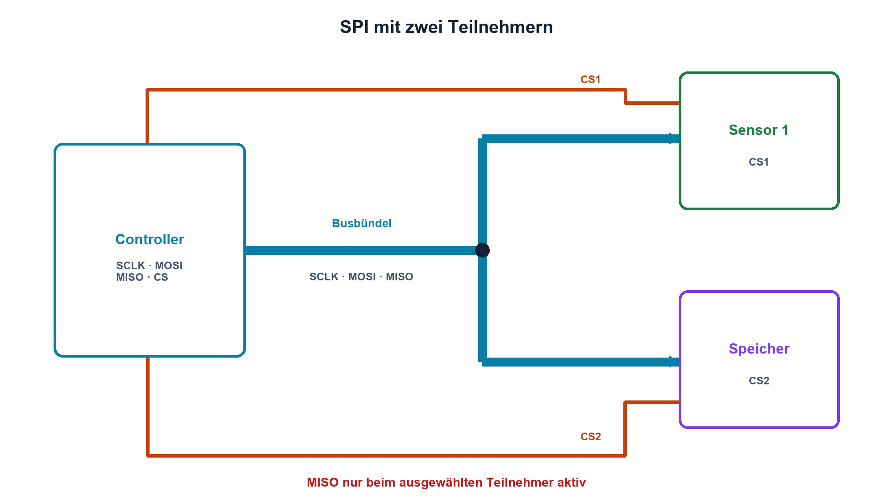

# 15.4 – SPI und Chip Select

[← Zurück](03-i-c-open-drain-und-pull-up.md) · [Modulübersicht](README.md) · [Kursübersicht](../README.md) · [Weiter →](05-rs-485-und-differentielle-uebertragung.md)

## Lernziele

Nach dieser Lektion kannst du:

- SCLK, MOSI, MISO und CS zuordnen
- CPOL und CPHA anhand von Zeitdiagrammen bestimmen
- MISO-Konflikte und Flankenprobleme diagnostizieren

## Warum ist das wichtig?

SPI erreicht hohe Datenraten und besitzt keine einheitliche automatische Rahmung. Bausteine unterscheiden sich bei Taktmodus, Wortlänge, Bitreihenfolge und Chip-Select-Zeit. Die elektrische Messung zeigt, was tatsächlich übertragen wurde.

## Theorie

### Vier Signalrollen

Der Controller erzeugt SCLK und wählt über CS einen Teilnehmer. MOSI führt Daten zum Teilnehmer, MISO zurück. Mehrere Teilnehmer teilen SCLK und MOSI; ihre MISO-Ausgänge müssen ausserhalb des eigenen CS hochohmig sein.

CPOL bestimmt den Ruhezustand des Takts, CPHA die Abtast- und Änderungsflanke. Daten benötigen Setup- und Hold-Zeit um die Abtastflanke. CS besitzt oft Mindestzeiten vor dem ersten und nach dem letzten Takt.

### Elektrische Grenzen

Schnelle Push-Pull-Flanken erzeugen Reflexionen und Übersprechen auf langen Leitungen. Serienwiderstände nahe am Treiber reduzieren Flankensteilheit und bedämpfen. Sternförmige SCLK-Abzweige sind kritisch. MISO-Konflikte zeigen sich als Zwischenpegel und hoher Strom.

## Anschauliches Beispiel

SCLK ist ein Dirigent, MOSI und MISO sind zwei Leserichtungen, und CS ruft genau einen Musiker auf. Spielen zwei Rückkanäle gleichzeitig, entsteht kein Duett, sondern ein elektrischer Konflikt.

## Berechnungsbeispiel

24 Bits bei 8 MHz benötigen ideal `24/8 MHz = 3 µs`. Fordert das Datenblatt zusätzlich 1 µs CS-Vorlauf und 0,5 µs Nachlauf, dauert der minimale Transfer 4,5 µs.

## Praxisbezug

Zeichne SCLK, MOSI, MISO und CS gemeinsam auf. Bestimme CPOL/CPHA, Setup/Hold und Bitreihenfolge. Vergleiche Flanken mit und ohne kleinen freigegebenen Serienwiderstand.

## 🔗 Hardware ↔ Firmware

Firmware wählt Modus, Prescaler, Wortlänge und CS-Sequenz. Hardwareprüfung kontrolliert Pegel, Timing und MISO-Freigabe. Detaillierte STM32-SPI-Programmierung bleibt im Programmierkurs.

## Merksatz

> SPI ist schnell, aber nur zuverlässig, wenn Taktmodus, CS-Timing, Bitreihenfolge und Leitungseigenschaften gemeinsam stimmen.

## Häufige Fehler und Missverständnisse

- CPOL und CPHA raten
- MISO mehrerer Teilnehmer gleichzeitig aktivieren
- CS-Timing auslassen
- hohe Taktfrequenz ohne Flanken- und Rückwegprüfung wählen

## Zusammenfassung

SPI verwendet getrennte Datenrichtungen und Auswahlleitungen. Das Datenblatt definiert das Protokoll, das Oszilloskop bestätigt Timing und Signalintegrität.

## Übungsfragen

1. Welche Leitung wählt den Teilnehmer?
2. Was unterscheidet CPOL und CPHA?
3. Wie lange dauern 40 Bit bei 10 MHz?
4. Woran erkennst du einen MISO-Konflikt?

Weitere Aufgaben: [Übungen zu Modul 15](../uebungen/modul-15.md).

## Bezug Bildungsplan 2026

- Handlungskompetenzen: `b1-LK01–06`, `b4`, `b5`, `c1–c2`, `d9`
- Nachweise: vierkanalige SPI-Timingmessung mit Datenblattvergleich; [Kompetenzmatrix](../bildungsplan-2026/kompetenzmatrix.md)
