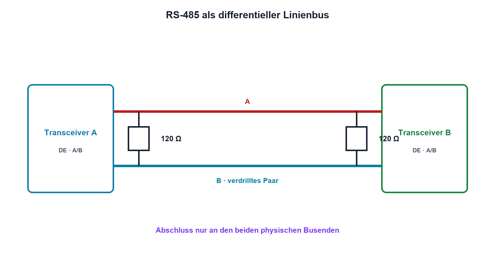

# 15.5 – RS-485 und differentielle Übertragung

[← Zurück](04-spi-und-chip-select.md) · [Modulübersicht](README.md) · [Kursübersicht](../README.md) · [Weiter →](06-can-terminierung-und-schutz.md)

## Lernziele

Nach dieser Lektion kannst du:

- differentielle Signalübertragung erklären
- Busleitung und Abschluss korrekt anordnen
- Treiberfreigabe und Failsafe-Zustand prüfen

## Einleitung

RS-485 überträgt Daten über lange Leitungen und in störender Umgebung. Der Empfänger wertet die Differenz zwischen A und B aus, doch Gleichtaktbereich, Abschluss, Topologie und Bezugspfad bleiben entscheidend.

<!-- context-expansion-2026 -->
Eine digitale Schnittstelle besteht aus Protokoll und physikalischer Übertragung. Register erzeugen Bits, Pad-Zellen und Transceiver erzeugen reale Pegel, und Leitung sowie Rückweg formen die Flanken. Diagnose muss daher Firmwarezustand und Messsignal gleichzeitig berücksichtigen.

Beim Thema **RS-485 und differentielle Übertragung** geht es deshalb nicht nur um eine einzelne Formel oder Definition. Entscheidend ist, wie sich das Prinzip im Schema erkennen, im Datenblatt beurteilen, im Aufbau messen und bei einer Abweichung systematisch überprüfen lässt.

## Theorie

<!-- theory-expansion-2026 -->
### Einordnung und Grundidee

Bei Bussystemen werden Datenrichtung, Treiberart, Bezugspotential und Abschluss vor der Protokolldekodierung geklärt. Ein Logic Analyzer zeigt logische Zustände; das Oszilloskop zeigt, ob Pegel und Flanken die Empfängergrenzen tatsächlich einhalten.

### Differenz statt einzelner Pegel

Der Transceiver treibt zwei Leitungen gegensinnig. Der Empfänger bildet `Udiff = UA − UB`; eingekoppelte gemeinsame Störungen heben sich innerhalb des Gleichtaktbereichs weitgehend auf.

Eine lange Leitung wird an beiden physischen Enden mit ihrem Wellenwiderstand abgeschlossen, typischerweise ungefähr 120 Ω bei passendem Kabel. Nicht jeder Teilnehmer erhält einen Abschluss. Stichleitungen bleiben kurz; der Bus wird als Linie geführt.

### Halbduplex und Ruhezustand

Bei Halbduplex steuert Driver Enable den Sender. Zwei aktive Treiber können kollidieren. Moderne Empfänger besitzen Failsafe, dennoch können Bias-Widerstände einen definierten Ruhezustand erzeugen. Ein Bezug oder Schirmkonzept hält Gleichtaktspannung im zulässigen Bereich; der Differenzbus ersetzt keine galvanische Trennung.

## Anwendungsfall

Typische elektronische Anwendungen und Baugruppen für dieses Thema sind:

- Industrielle Mehrpunktverbindungen
- Lange Leitungen in störender Umgebung
- Halbduplex-Kommunikation mit Transceivern

In einer konkreten Entwicklung wird nicht nur geprüft, ob die gewünschte Funktion grundsätzlich entsteht. Ebenso wichtig sind zulässige Grenzwerte, Toleranzen, Temperatur, Messbarkeit und das Verhalten bei Unterbruch, Kurzschluss oder falscher Ansteuerung.

## Anschauliches Beispiel

Zwei Personen tragen eine Stange: Entscheidend ist der Höhenunterschied zwischen beiden Enden. Hebt eine Bodenwelle beide Personen gleich an, bleibt der Unterschied nahezu gleich.

## Berechnungsbeispiel

Zwei 120-Ω-Abschlüsse liegen aus Sicht des Treibers parallel und ergeben 60 Ω. Bei 2 V differentieller Spannung fliesst ideal etwa `2 V/60 Ω = 33 mA`, zusätzlich zu Bias- und Knotenströmen.

## Praxisbezug

Miss A und B jeweils gegen Bezug sowie differentiell. Vergleiche korrekte, fehlende und zusätzliche Terminierung an sicherer Übungshardware. Beobachte Driver-Enable beim Richtungswechsel.

## 🔗 Hardware ↔ Firmware

UART liefert die Daten, ein GPIO oder Transceiver steuert DE. Firmware muss nach dem letzten Stopbit lange genug senden und dann freigeben. Kollisions- und Timeoutbehandlung ergänzen die Hardware.

## Merksatz

> RS-485 ist ein differentieller Linienbus; Abschluss gehört nur an die beiden Enden und Gleichtaktgrenzen bleiben verbindlich.

## Häufige Fehler und Missverständnisse

- jeden Teilnehmer mit 120 Ω abschliessen
- Sternverkabelung mit langen Stichleitungen
- DE vor dem letzten Bit deaktivieren
- Differenzmessung ohne Gleichtaktprüfung

## Zusammenfassung

Differentialübertragung verbessert Störfestigkeit. Leitungsführung, zwei Abschlüsse, Treiberfreigabe und zulässiger Gleichtaktbereich bestimmen die Zuverlässigkeit.

## Übungsfragen

1. Warum liegen zwei Abschlüsse parallel?
2. Welchen Strom verlangt 1,5 V an 60 Ω?
3. Was macht Driver Enable?
4. Wann ist galvanische Trennung nötig?

Weitere Aufgaben: [Übungen zu Modul 15](../uebungen/modul-15.md).

## Bezug Bildungsplan 2026

- Handlungskompetenzen: `b1-LK01–06`, `b2-LK03–04`, `b4`, `b5`, `c1–c2`, `d9`
- Nachweise: differentielle Busmessung mit Abschlussvergleich; [Kompetenzmatrix](../bildungsplan-2026/kompetenzmatrix.md)
