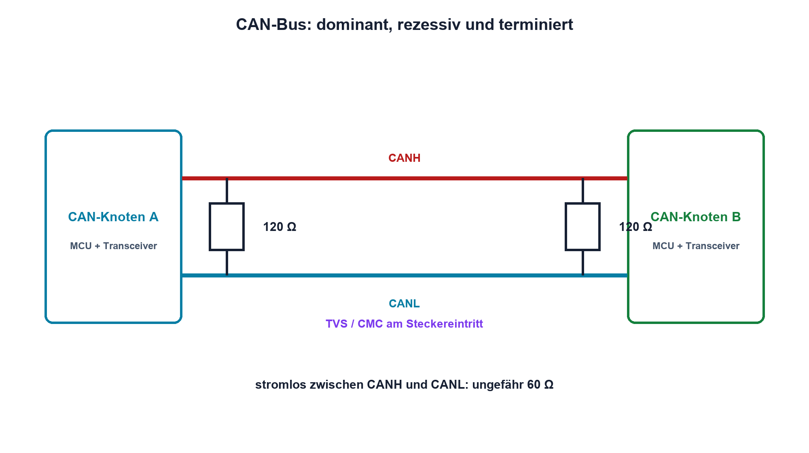

# 15.6 – CAN, Terminierung und Schutz

[← Zurück](05-rs-485-und-differentielle-uebertragung.md) · [Modulübersicht](README.md) · [Kursübersicht](../README.md) · [Weiter →](07-pegelwandler-leitungskapazitaet-und-signalintegritaet.md)

## Lernziele

Nach dieser Lektion kannst du:

- dominanten und rezessiven CAN-Zustand elektrisch erklären
- Terminierung und Buswiderstand prüfen
- Transceiver, Schutz und Massekonzept unterscheiden

## Einleitung

CAN kombiniert differentiellen Bus, Arbitration und robuste Fehlererkennung. Auf der Leiterplatte sieht der Mikrocontroller nur TXD und RXD; die realen Buspegel entstehen im Transceiver und auf der Leitung.

<!-- context-expansion-2026 -->
Eine digitale Schnittstelle besteht aus Protokoll und physikalischer Übertragung. Register erzeugen Bits, Pad-Zellen und Transceiver erzeugen reale Pegel, und Leitung sowie Rückweg formen die Flanken. Diagnose muss daher Firmwarezustand und Messsignal gleichzeitig berücksichtigen.

Beim Thema **CAN, Terminierung und Schutz** geht es deshalb nicht nur um eine einzelne Formel oder Definition. Entscheidend ist, wie sich das Prinzip im Schema erkennen, im Datenblatt beurteilen, im Aufbau messen und bei einer Abweichung systematisch überprüfen lässt.

## Theorie

<!-- theory-expansion-2026 -->
### Einordnung und Grundidee

Bei Bussystemen werden Datenrichtung, Treiberart, Bezugspotential und Abschluss vor der Protokolldekodierung geklärt. Ein Logic Analyzer zeigt logische Zustände; das Oszilloskop zeigt, ob Pegel und Flanken die Empfängergrenzen tatsächlich einhalten.

### Dominant gewinnt

Im rezessiven Zustand liegen CANH und CANL nahe beieinander. Dominant treibt der Transceiver CANH höher und CANL tiefer. Mehrere Teilnehmer dürfen dominant senden; deshalb funktioniert bitweise Arbitration ohne zerstörerischen Konflikt.

Zwei 120-Ω-Abschlüsse sitzen an den Busenden. Stromlos gemessen ergibt der Bus zwischen CANH und CANL ungefähr 60 Ω, sofern keine zusätzlichen Pfade dominieren. Split-Terminierung kann den Gleichtakt hochfrequent stabilisieren.

### Transceiver und Schutz

Der Transceiver stellt Gleichtaktfestigkeit, Flankensteuerung und oft Standby bereit. TVS-Dioden, Common-Mode-Drossel und ESD-Konzept werden passend zur Umgebung gewählt; Schutzbauteile fügen Kapazität hinzu. Galvanische Trennung benötigt isolierte Versorgung und einen getrennten Bezug.

Bitrate, Buslänge und Stichleitungen begrenzen sich gegenseitig. Fehlerzähler und Bus-off sind Protokollreaktionen, ersetzen aber keine saubere physikalische Schicht.

## Anwendungsfall

Typische elektronische Anwendungen und Baugruppen für dieses Thema sind:

- Fahrzeug- und Maschinenkommunikation
- Robuste verteilte Steuerungen
- Diagnose von Terminierung und Busfehlern

In einer konkreten Entwicklung wird nicht nur geprüft, ob die gewünschte Funktion grundsätzlich entsteht. Ebenso wichtig sind zulässige Grenzwerte, Toleranzen, Temperatur, Messbarkeit und das Verhalten bei Unterbruch, Kurzschluss oder falscher Ansteuerung.

## Anschauliches Beispiel

In einer Sitzung bedeutet Schweigen «rezessiv». Sobald eine Person deutlich Einspruch erhebt, hören es alle – dominant gewinnt, ohne dass mehrere Einsprechende gegeneinander treiben.

## Berechnungsbeispiel

Zwei 120-Ω-Abschlüsse ergeben 60 Ω. Zeigt die stromlose Messung etwa 40 Ω, liegt wahrscheinlich ein dritter 120-Ω-Abschluss parallel: `1/(1/120 + 1/120 + 1/120) = 40 Ω`.

## Praxisbezug

Miss den stromlosen Buswiderstand. Zeichne CANH, CANL und die Differenz bei dominantem und rezessivem Bit auf. Verändere Terminierung nur an freigegebener Laborhardware.

## 🔗 Hardware ↔ Firmware

Der CAN-Controller behandelt Bit-Timing, Arbitration und Fehlerzähler; der Transceiver erzeugt Buspegel. Bei Bus-off werden sowohl Protokollstatus als auch Versorgung, Abschluss und reale Signalform geprüft.

## Merksatz

> CAN-Protokoll und CAN-Physik sind getrennte Ebenen; Transceiver, Leitung und zwei Abschlüsse erzeugen den messbaren Bus.

## Häufige Fehler und Missverständnisse

- TXD/RXD mit CANH/CANL verwechseln
- Abschluss nach Teilnehmerzahl setzen
- nur CANH gegen GND beurteilen
- Bus-off ausschliesslich als Softwarefehler behandeln

## Zusammenfassung

CAN verwendet dominante und rezessive differentielle Zustände. Topologie, Abschluss, Schutz und Gleichtakt bestimmen die physikalische Zuverlässigkeit.

## Übungsfragen

1. Welcher Zustand gewinnt bei Arbitration?
2. Was bedeutet 40 Ω am stromlosen Bus?
3. Welche Aufgabe hat der Transceiver?
4. Welche Hardware prüfst du bei Bus-off?

Weitere Aufgaben: [Übungen zu Modul 15](../uebungen/modul-15.md).

## Bezug Bildungsplan 2026

- Handlungskompetenzen: `b1-LK01–06`, `b2-LK03–04`, `b4`, `b5`, `c1–c2`, `d9`
- Nachweise: Widerstands- und Differenzmessung eines CAN-Busses; [Kompetenzmatrix](../bildungsplan-2026/kompetenzmatrix.md)
