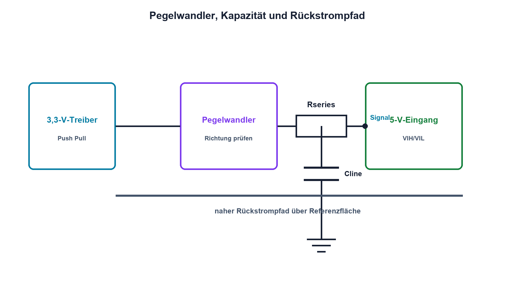

# 15.7 – Pegelwandler, Leitungskapazität und Signalintegrität

[← Zurück](06-can-terminierung-und-schutz.md) · [Modulübersicht](README.md) · [Kursübersicht](../README.md) · [Weiter →](../16-stromversorgungen/README.md)

## Lernziele

Nach dieser Lektion kannst du:

- Pegelwandler passend zur Signalrichtung auswählen
- Kapazität und Flankenzeit quantitativ verbinden
- Rückstrompfad und Reflexion als Systemproblem erklären

## Einleitung

Ein Bus kann bei niedriger Frequenz viele Bits pro Sekunde übertragen und trotzdem sehr schnelle Flanken besitzen. Für Signalintegrität zählt die Flankenzeit im Verhältnis zur Leitungslaufzeit, nicht nur die Taktrate.

<!-- context-expansion-2026 -->
Eine digitale Schnittstelle besteht aus Protokoll und physikalischer Übertragung. Register erzeugen Bits, Pad-Zellen und Transceiver erzeugen reale Pegel, und Leitung sowie Rückweg formen die Flanken. Diagnose muss daher Firmwarezustand und Messsignal gleichzeitig berücksichtigen.

Beim Thema **Pegelwandler, Leitungskapazität und Signalintegrität** geht es deshalb nicht nur um eine einzelne Formel oder Definition. Entscheidend ist, wie sich das Prinzip im Schema erkennen, im Datenblatt beurteilen, im Aufbau messen und bei einer Abweichung systematisch überprüfen lässt.

## Theorie

<!-- theory-expansion-2026 -->
### Einordnung und Grundidee

Bei Bussystemen werden Datenrichtung, Treiberart, Bezugspotential und Abschluss vor der Protokolldekodierung geklärt. Ein Logic Analyzer zeigt logische Zustände; das Oszilloskop zeigt, ob Pegel und Flanken die Empfängergrenzen tatsächlich einhalten.

### Richtungs- und Treiberart

Ein unidirektionaler Puffer eignet sich für bekannte Richtung. Bidirektionale automatische Wandler besitzen Einschränkungen bei Last, Pull-ups und Protokoll. Der bekannte MOSFET-Pegelwandler passt zu Open-Drain-Bussen, aber nicht allgemein zu schnellen Push-Pull-Signalen.

Leitungskapazität bildet mit Ausgangswiderstand oder Pull-up eine Zeitkonstante. Eine langsame Flanke reduziert Störabstrahlung, kann aber Setup-Zeit verletzen. Eine sehr schnelle Flanke sieht eine längere Leiterbahn als Übertragungsleitung; Impedanzsprünge erzeugen Reflexionen.

### Signal und Rückweg

Jeder Signalstrom benötigt einen nahen Rückstrompfad, meist über eine Referenzfläche. Schlitze, Stecker und Ebenenwechsel vergrössern die Schleife und Kopplung. Serienabschluss nahe am Treiber kann den Quellwiderstand an die Leitung anpassen. Tastkopfmassen müssen kurz sein, sonst erzeugt die Messung selbst Ringing.

## Anwendungsfall

Typische elektronische Anwendungen und Baugruppen für dieses Thema sind:

- Verbindung unterschiedlicher Logikspannungen
- Anpassung schneller Leiterbahnen und Kabel
- Reduktion von Reflexion, Übersprechen und Messartefakten

In einer konkreten Entwicklung wird nicht nur geprüft, ob die gewünschte Funktion grundsätzlich entsteht. Ebenso wichtig sind zulässige Grenzwerte, Toleranzen, Temperatur, Messbarkeit und das Verhalten bei Unterbruch, Kurzschluss oder falscher Ansteuerung.

## Anschauliches Beispiel

Ein kurzer Wasserstoss in einem langen Rohr erzeugt Druckwellen und Echos. Nicht die Anzahl Stösse pro Sekunde allein, sondern die Schärfe jedes Stosses bestimmt das Wellenverhalten.

## Berechnungsbeispiel

Ein Pull-up 3,3 kΩ treibt 150 pF. Für eine RC-Flanke gilt grob `tr(10–90 %) ≈ 2,2·R·C ≈ 1,09 µs`. Ein Protokoll mit geforderten 300 ns benötigt kleineren Widerstand, kleinere Kapazität oder aktiven Treiber.

## Praxisbezug

Miss dieselbe Leitung mit langer Masseleitung und Massefeder, dann mit zwei Serienwiderständen. Dokumentiere Anstiegszeit, Überschwingen und Messaufbau. Änderungen erfolgen nur innerhalb der Treibergrenzen.

## 🔗 Hardware ↔ Firmware

Geringere Datenrate kann helfen, beseitigt aber nicht jedes Flankenproblem. Viele MCUs erlauben langsamere GPIO-Slew-Rate oder Drive Strength. Firmwareparameter werden erst nach elektrischer Messung freigegeben.

## Merksatz

> Für Signalintegrität zählen Flankenzeit, Leitung, Abschluss und Rückstrompfad – nicht nur die nominelle Busfrequenz.

## Häufige Fehler und Missverständnisse

- jeden Pegelwandler für jedes Protokoll verwenden
- Taktrate statt Flankenzeit beurteilen
- Rückstrompfad im Layout vergessen
- Tastkopf-Ringing als Schaltungsfehler interpretieren

## Zusammenfassung

Pegelwandler müssen zur Richtung und Treiberart passen. Kapazität, Leitungsimpedanz und Rückweg formen die reale Flanke.

## Übungsfragen

1. Wann eignet sich der MOSFET-I²C-Wandler?
2. Berechne tr für 4,7 kΩ und 100 pF.
3. Warum hilft ein Serienwiderstand?
4. Welche GPIO-Einstellung beeinflusst die Flanke?

Weitere Aufgaben: [Übungen zu Modul 15](../uebungen/modul-15.md).

## Bezug Bildungsplan 2026

- Handlungskompetenzen: `b1-LK01–06`, `b2-LK03–04`, `b4`, `b5`, `c1–c2`, `d9`
- Nachweise: dokumentierter Flanken- und Rückwegvergleich; [Kompetenzmatrix](../bildungsplan-2026/kompetenzmatrix.md)
