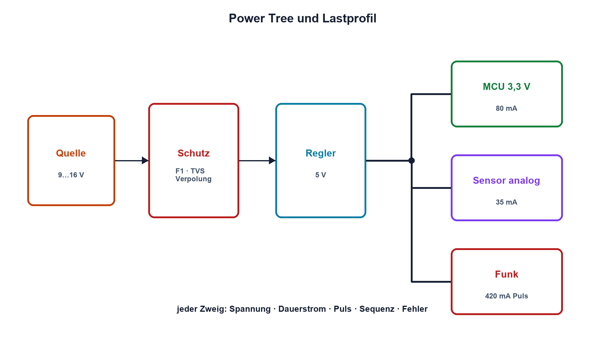

# 16.1 – Anforderungen, Lastprofile und Schutz

[← Zurück](../15-schnittstellen-busse/07-pegelwandler-leitungskapazitaet-und-signalintegritaet.md) · [Modulübersicht](README.md) · [Kursübersicht](../README.md) · [Weiter →](02-linearregler-und-ldo.md)

## Lernziele

Nach dieser Lektion kannst du:

- eine Versorgungsspezifikation vollständig formulieren
- Lastprofil und Einschaltzustände berücksichtigen
- eine Power-Tree-Struktur mit Schutz planen

## Warum ist das wichtig?

«Wir brauchen 3,3 V» ist keine ausreichende Spezifikation. Eingang, Dauer- und Spitzenstrom, Ripple, Startreihenfolge, Fehlerfälle, Temperatur und Wirkungsgrad bestimmen Topologie und Bauteile. Eine Versorgung wird vom Lastprofil her entworfen.

## Theorie

### Anforderungen vor Schaltung

Festgelegt werden minimaler, nominaler und maximaler Eingang, Ausgangstoleranz, Dauer- und Pulsstrom, zulässiger Ripple, Lastsprung, Startzeit, Sequenz, Ruhestrom, Umgebungstemperatur und Schutz. Kabelabfall und Steckverbinder gehören zum Eingang.

Ein Power Tree zeigt jede Schiene, Quelle, Last und Abhängigkeit. Analoge, digitale und leistungsstarke Verbraucher können getrennte Filter oder Regler benötigen, bleiben aber über Masse- und Rückstrompfade gekoppelt.

### Energie und Fehlerzustände

Kondensatoren, Akkus und induktive Lasten speichern Energie. Einschaltstrom, Brownout, Rückspeisung und Hot Plug werden berücksichtigt. Schutz umfasst Sicherung oder Strombegrenzung, Verpolung, Überspannung, ESD/Surge und thermische Abschaltung. Die Reihenfolge entscheidet: Ein TVS ohne vorgeschaltete Strombegrenzung kann überlastet werden.

## Anschauliches Beispiel

Eine Wasserversorgung wird nicht nur nach dem gewünschten Druck geplant. Gleichzeitig öffnende Ventile, Rohrverluste, Rückfluss, Lecks und Notabsperrung bestimmen die Anlage.

## Berechnungsbeispiel

Eine 3,3-V-Schiene versorgt MCU 80 mA, Sensoren 35 mA und Funkmodul mit 420 mA Pulsen. Mit 25 % Reserve sind mindestens `(80 + 35 + 420) mA·1,25 ≈ 669 mA` Spitzenfähigkeit nötig. Dauerleistung wird separat aus dem zeitlichen Lastprofil bestimmt.

## Praxisbezug

Zeichne den Power Tree eines Übungssystems. Miss jede Last im Schlaf-, Normal- und Spitzenzustand und überprüfe Kabel- sowie Steckerverlust. Lege Messpunkte und Abbruchgrenzen fest.

## 🔗 Hardware ↔ Firmware

Firmware steuert Sleep, Funkpulse und Power Enable und beeinflusst damit das Lastprofil. Hardware muss einen sicheren Reset- und Fehlerzustand gewährleisten. Brownout-Flags und Versorgungstelemetrie helfen bei der Diagnose.

## Merksatz

> Eine Stromversorgung wird für den vollständigen Eingangs-, Last-, Zeit-, Temperatur- und Fehlerbereich spezifiziert.

## Häufige Fehler und Missverständnisse

- nur Nennstrom statt Lastprofil angeben
- Einschaltstrom und Rückspeisung vergessen
- Schutzbauteile ohne Energiepfad anordnen
- Firmwarezustände nicht in die Lastanalyse aufnehmen

## Zusammenfassung

Spezifikation und Power Tree verbinden Quelle, Regler, Schutz und reale Lastzustände. Erst daraus folgt die geeignete Topologie.

## Übungsfragen

1. Welche Angaben fehlen bei 3,3 V/1 A?
2. Warum werden Puls- und Dauerstrom getrennt?
3. Was zeigt ein Power Tree?
4. Welche Firmwarezustände verändern die Versorgung?

Weitere Aufgaben: [Übungen zu Modul 16](../uebungen/modul-16.md).

## Bezug Bildungsplan 2026

- Handlungskompetenzen: `a1–a3`, `b1-LK01–07`, `b4`, `b5`, `c1–c2`
- Nachweise: vollständige Versorgungsspezifikation und Lastprofiltabelle; [Kompetenzmatrix](../bildungsplan-2026/kompetenzmatrix.md)
