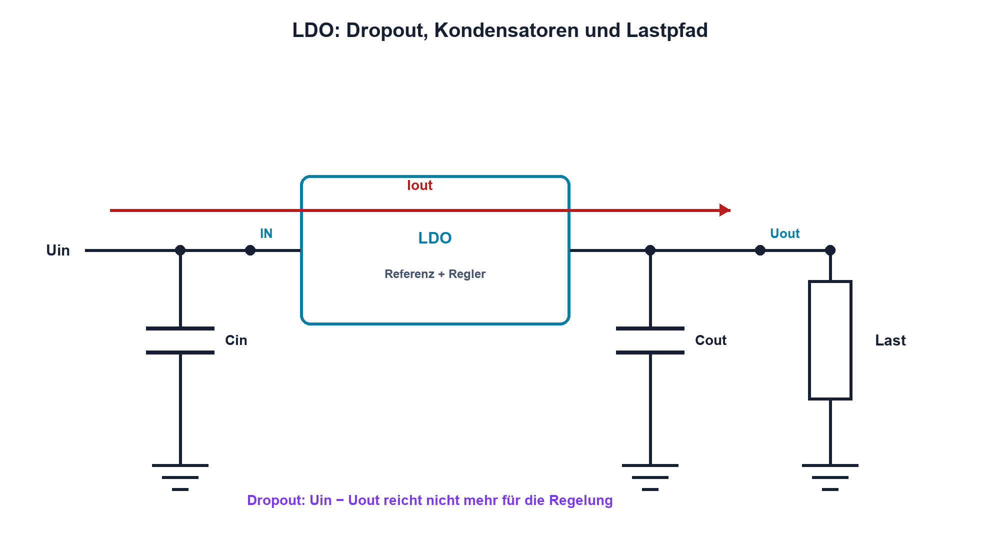

# 16.2 – Linearregler und LDO

[← Zurück](01-anforderungen-lastprofile-und-schutz.md) · [Modulübersicht](README.md) · [Kursübersicht](../README.md) · [Weiter →](03-verlustleistung-und-thermische-grundlagen.md)

## Lernziele

Nach dieser Lektion kannst du:

- Linearregler und LDO erklären
- Dropout und Verlustleistung bestimmen
- Stabilitätsvorgaben für Kondensatoren prüfen

## Einleitung

Linearregler sind einfach, rauscharm und gut messbar. Sie wandeln überschüssige Spannung jedoch direkt in Wärme. Ein LDO funktioniert mit kleinerer Spannungsreserve, bleibt aber ein Regelkreis mit Stabilitäts- und Lastgrenzen.

<!-- context-expansion-2026 -->
Eine Stromversorgung ist eine dynamische Energiequelle für die gesamte Baugruppe. Eingang, Schutz, Regler, Leiterpfade, Kondensatoren und Lastprofil bilden ein System. Nennspannung allein genügt weder für die Dimensionierung noch für die Verifikation.

Beim Thema **Linearregler und LDO** geht es deshalb nicht nur um eine einzelne Formel oder Definition. Entscheidend ist, wie sich das Prinzip im Schema erkennen, im Datenblatt beurteilen, im Aufbau messen und bei einer Abweichung systematisch überprüfen lässt.

## Theorie

<!-- theory-expansion-2026 -->
### Einordnung und Grundidee

Versorgungen werden über Leistungs- und Strompfade analysiert. Für jeden Betriebszustand werden Eingang, Ausgang, Verlust, Temperatur und gespeicherte Energie bilanziert. Dynamische Vorgänge wie Einschalten und Lastsprung werden zusätzlich im Zeitbereich gemessen.

Ein einfacher Festspannungsregler besitzt Eingang `IN`, Ausgang `OUT` und Bezug `GND`; Varianten ergänzen Enable, Feedback, Power Good oder Sense. Die Kondensatoren an IN und OUT sind elektrische Bestandteile der Anwendungsschaltung und werden mit kurzen Rückwegen angeschlossen. Pinout und freigegebene Kondensatorbereiche stammen aus dem Datenblatt des konkreten Reglers.

### Serien-Stellglied

Der Regler vergleicht einen Anteil von Uout mit einer Referenz und steuert ein Serienbauteil. Idealerweise ist `Iin ≈ Iout + IQ`, wobei IQ der Ruhestrom des Reglers ist.

Die Verlustleistung lautet näherungsweise `PV = (Uin − Uout)·Iout + Uin·IQ`. Dropout ist die minimale Differenz zwischen Ein- und Ausgang für garantierte Regelung und hängt von Strom und Temperatur ab.

### Regelgüte und Stabilität

Line Regulation beschreibt Änderungen mit Uin, Load Regulation mit Last. PSRR zeigt, wie gut Eingangsstörungen unter bestimmten Frequenzen gedämpft werden. Ausgangsrauschen ist separat spezifiziert.

Ein- und Ausgangskondensator sind Teil der Regelschleife. Wert, ESR, Typ, Temperatur und Platzierung müssen zum Datenblatt passen. Keramikkondensatoren verlieren unter DC-Bias Kapazität. Mindestlast, Reverse Current und Enable-Zustand werden ebenfalls geprüft.

## Anwendungsfall

Typische elektronische Anwendungen und Baugruppen für dieses Thema sind:

- Rauscharme Analog- und Sensorspeisung
- Nachregelung aus Batterie oder Vorregler
- Einfache Hilfsspannungen kleiner Leistung

In einer konkreten Entwicklung wird nicht nur geprüft, ob die gewünschte Funktion grundsätzlich entsteht. Ebenso wichtig sind zulässige Grenzwerte, Toleranzen, Temperatur, Messbarkeit und das Verhalten bei Unterbruch, Kurzschluss oder falscher Ansteuerung.

## Anschauliches Beispiel

Ein Druckminderventil hält den Ausgangsdruck konstant und vernichtet den überschüssigen Druck. Je grösser Druckdifferenz und Durchfluss, desto mehr Energie wird im Ventil warm.

## Berechnungsbeispiel

12 V werden auf 5 V bei 180 mA geregelt. Ohne IQ gilt `PV = 7 V·0,18 A = 1,26 W`; die Last erhält 0,90 W. Der ideale Wirkungsgrad liegt nur bei `5/12 ≈ 41,7 %`. Thermik ist der entscheidende Nachweis.

## Praxisbezug

Miss Uout über Eingang und Last, bestimme Dropout bei langsam sinkendem Uin und beobachte Lastsprung. Verwende ausschliesslich freigegebene Kondensatoren und begrenzte Leistung.

## 🔗 Hardware ↔ Firmware

Enable-Pins und Power-Good können sequenziert und überwacht werden. Firmware kann Last reduzieren, bevor der Regler thermisch abschaltet; sie darf stabile Versorgung beim Booten nicht voraussetzen.

## Merksatz

> Ein LDO spart Spannungsreserve, nicht Verlustleistung; seine Kondensatoren gehören zur Stabilität des Regelkreises.

## Häufige Fehler und Missverständnisse

- Dropout als konstanten typischen Wert verwenden
- Ruhestrom bei Batteriebetrieb vergessen
- beliebigen Ausgangskondensator einsetzen
- PSRR als frequenzunabhängig ansehen

## Zusammenfassung

Linearregler liefern saubere Spannung mit einfacher Topologie. Eingangsdifferenz, Strom, Dropout, Thermik und Stabilitätskondensatoren bestimmen die Eignung.

## Übungsfragen

1. Wie entsteht PV?
2. Berechne PV für 9 V auf 3,3 V bei 250 mA.
3. Was bedeutet Dropout?
4. Warum ist Cout Teil der Regelschleife?

Weitere Aufgaben: [Übungen zu Modul 16](../uebungen/modul-16.md).

## Bezug Bildungsplan 2026

- Handlungskompetenzen: `a3`, `b1-LK01–07`, `b4`, `b5`, `c1–c2`
- Nachweise: Dropout-, Last- und Temperaturmessung eines LDO; [Kompetenzmatrix](../bildungsplan-2026/kompetenzmatrix.md)
