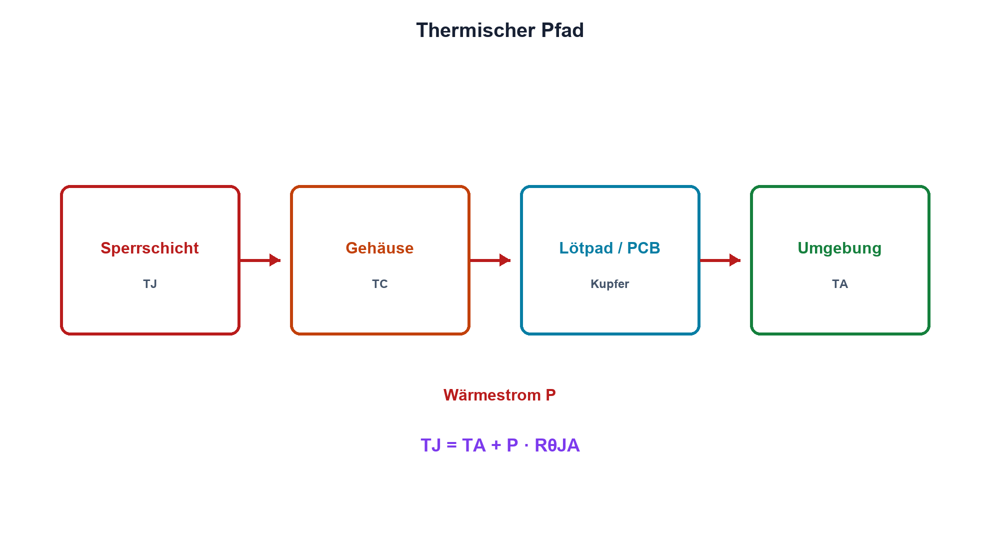

# 16.3 – Verlustleistung und thermische Grundlagen

[← Zurück](02-linearregler-und-ldo.md) · [Modulübersicht](README.md) · [Kursübersicht](../README.md) · [Weiter →](04-schaltregler-buck-boost-und-buck-boost.md)

## Lernziele

Nach dieser Lektion kannst du:

- thermische Widerstände und Temperaturen zuordnen
- Sperrschichttemperatur abschätzen
- Datenblattbedingungen und PCB-Kühlpfad berücksichtigen

## Warum ist das wichtig?

Elektrische Verlustleistung wird als Wärme abgeführt. Ein Bauteil kann elektrisch korrekt dimensioniert sein und dennoch wegen Gehäuse, Kupferfläche oder Umgebung überhitzen. Temperatur ist deshalb ein eigener Stromkreis aus Wärmefluss und Widerständen.

## Theorie

### Thermisches Ersatznetz

Wärme fliesst von der Sperrschicht über Gehäuse, Lötpad, Leiterplatte und Luft. Der thermische Widerstand Rθ in K/W beschreibt die Temperaturdifferenz pro Watt. Für eine grobe stationäre Abschätzung gilt `TJ = TA + PV·RθJA`.

TJ ist die Sperrschichttemperatur, TA die Umgebungstemperatur, PV die Verlustleistung und RθJA der thermische Widerstand Junction-to-Ambient. RθJA gilt nur für die im Datenblatt beschriebene Platine, Kupferfläche und Luftbewegung.

### Transient und Derating

Wärmekapazitäten verzögern den Temperaturanstieg. Kurze Pulse werden mit transienter thermischer Impedanz bewertet. Dauerbetrieb benötigt stationären Nachweis. Maximaltemperatur wird nicht als Ziel verwendet; Reserve deckt Toleranz, Gehäuse, Sonneneinstrahlung und Alterung ab.

Exposed Pads benötigen definierte Kupferflächen und thermische Vias. Kühlkörper wirken nur mit kontrolliertem Kontaktwiderstand.

## Anschauliches Beispiel

Wärmefluss ähnelt Strom: Verlustleistung ist der Fluss, Temperaturdifferenz die treibende «Spannung» und der thermische Widerstand bremst den Abtransport.

## Berechnungsbeispiel

PV = 1,5 W, TA = 45 °C und RθJA = 55 K/W ergeben `TJ ≈ 45 °C + 1,5·55 K = 127,5 °C`. Bei 125 °C zulässigem Entwurfsziel ist der Aufbau ungeeignet, selbst wenn Absolute Maximum höher liegt.

## Praxisbezug

Miss Gehäuse- und Umgebungstemperatur bis zum thermischen Gleichgewicht. Verwende Wärmebildkamera oder Sensor korrekt emissivitätsbewertet. Leite TJ nur mit bekanntem Mess- und Thermikmodell ab.

## 🔗 Hardware ↔ Firmware

Temperatursensoren und Lastreduktion können schützen. Firmware reagiert jedoch verzögert und benötigt funktionsfähige Versorgung; hardwareseitige Thermal Shutdown und Strombegrenzung bleiben wichtig.

## Merksatz

> Watt werden nur mit einem definierten thermischen Pfad zu einer zulässigen Sperrschichttemperatur.

## Häufige Fehler und Missverständnisse

- RθJA ohne Datenblatt-Testplatine übernehmen
- Gehäusetemperatur mit TJ gleichsetzen
- kurzen Puls als Dauerleistung rechnen oder umgekehrt
- Absolute Maximum als Entwurfsziel verwenden

## Zusammenfassung

Thermische Widerstände verbinden Verlustleistung und Temperatur. Layout, Zeitverlauf, Umgebung und Reserve entscheiden über den sicheren Betrieb.

## Übungsfragen

1. Was bedeutet K/W?
2. Berechne TJ für 0,8 W, 60 K/W und 40 °C.
3. Warum ist RθJA layoutabhängig?
4. Welche Schutzfunktion kann Firmware ergänzen?

Weitere Aufgaben: [Übungen zu Modul 16](../uebungen/modul-16.md).

## Bezug Bildungsplan 2026

- Handlungskompetenzen: `a3`, `b1-LK01–07`, `b2-LK03–04`, `b4`, `b5`
- Nachweise: thermische Rechnung und stationäre Temperaturmessung; [Kompetenzmatrix](../bildungsplan-2026/kompetenzmatrix.md)
