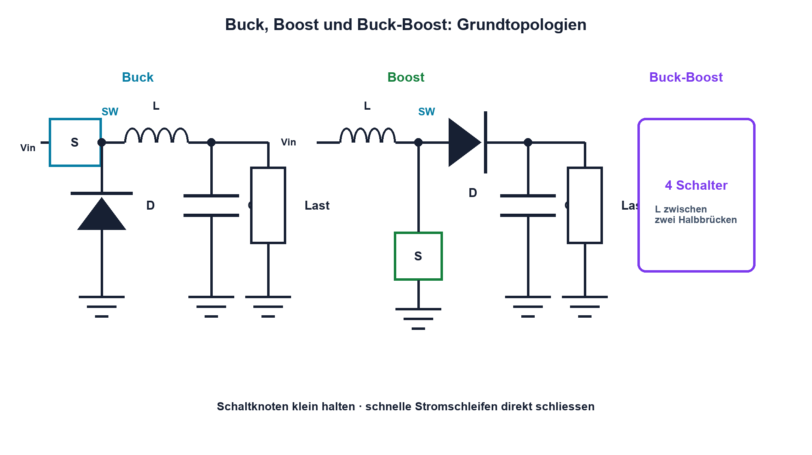

# 16.4 – Schaltregler: Buck, Boost und Buck-Boost

[← Zurück](03-verlustleistung-und-thermische-grundlagen.md) · [Modulübersicht](README.md) · [Kursübersicht](../README.md) · [Weiter →](05-ripple-und-wirkungsgrad.md)

## Lernziele

Nach dieser Lektion kannst du:

- Buck-, Boost- und Buck-Boost-Energiepfade unterscheiden
- idealen Tastgrad abschätzen
- Schaltknoten und Stromschleifen erkennen

## Warum ist das wichtig?

Schaltregler übertragen Energie paketweise und erreichen hohe Wirkungsgrade. Ihre Funktion wird verständlich, wenn für Ein- und Aus-Zustand jeweils der Strompfad durch Schalter, Diode beziehungsweise Synchron-MOSFET, Spule und Kondensator verfolgt wird.

## Theorie

### Drei Grundtopologien

Der Buck senkt Spannung; ideal gilt im kontinuierlichen Betrieb `Uout ≈ D·Uin`. Der Boost erhöht; ideal `Uout ≈ Uin/(1 − D)`. Buck-Boost-Varianten können erhöhen und senken, unterscheiden sich aber bei Polarität, Schaltern und Strompfaden.

D ist der Tastgrad zwischen 0 und 1. Die idealen Formeln ignorieren Schaltverluste, Widerstände, Diodenabfall, Totzeit und Regelreserve.

### Stromschleifen und Layout

Die Spule glättet Strom, der Ausgangskondensator Spannung. Besonders kritisch sind Schleifen mit schnell wechselndem Strom: beim Buck Eingangskondensator, High-Side-Schalter und Low-Side-Pfad. Der Schaltknoten besitzt hohe dv/dt und bleibt klein sowie fern von Feedback und empfindlichen Signalen.

Reglerdatenblätter geben Induktivität, Schaltfrequenz, Kompensation und Layout vor. Ein scheinbar gleiches Schema kann durch schlechtes Layout unbrauchbar werden.

## Anschauliches Beispiel

Eine Person schiebt eine Schaukel in kurzen Impulsen. Die Schaukel speichert Energie und gibt sie zwischen den Impulsen weiter; der zeitliche Anteil der Impulse bestimmt die mittlere Energie.

## Berechnungsbeispiel

Ein idealer Buck wandelt 12 V auf 5 V. `D ≈ 5/12 = 0,417`. Bei 500 kHz dauert eine Periode 2 µs; die ideale Einschaltzeit beträgt etwa 0,834 µs. Reale Verluste verschieben den Tastgrad.

## Praxisbezug

Identifiziere an einem fertigen Evaluationsboard Eingangsschleife, Schaltknoten, Spule und Ausgangspfad. Miss nur mit geeigneter Massefeder und innerhalb der Tastkopfspannung. Keine eigene Netzspannungsversorgung verwenden.

## 🔗 Hardware ↔ Firmware

Manche Regler besitzen Enable, Power Good, programmierbare Modi oder digitale Telemetrie. PWM-Leistungsschalten im MCU folgt denselben Energie- und Totzeitprinzipien, benötigt aber dafür ausgelegte Treiber und Schutz.

## Merksatz

> Schaltregler werden durch ihre Energiepfade verstanden; schnelle Stromschleifen und der Schaltknoten bestimmen das Layout.

## Häufige Fehler und Missverständnisse

- ideale Tastgradformel als vollständige Dimensionierung verwenden
- Schaltknoten grossflächig routen
- Eingangskondensator weit entfernt platzieren
- Oszilloskopmasse als lange Schleife anschliessen

## Zusammenfassung

Buck, Boost und Buck-Boost speichern und übertragen Energie über Schaltzustände. Topologie, Bauteile, Regelung und Layout müssen zusammenpassen.

## Übungsfragen

1. Welche Topologie senkt Spannung?
2. Berechne D für einen idealen Buck 24 V auf 9 V.
3. Warum ist der Schaltknoten kritisch?
4. Welche Schleife benötigt den kürzesten Pfad?

Weitere Aufgaben: [Übungen zu Modul 16](../uebungen/modul-16.md).

## Bezug Bildungsplan 2026

- Handlungskompetenzen: `a2–a3`, `b1-LK01–09`, `b2-LK03–04`, `b4`, `b5`
- Nachweise: Energiepfad- und Layoutanalyse eines Schaltreglers; [Kompetenzmatrix](../bildungsplan-2026/kompetenzmatrix.md)
