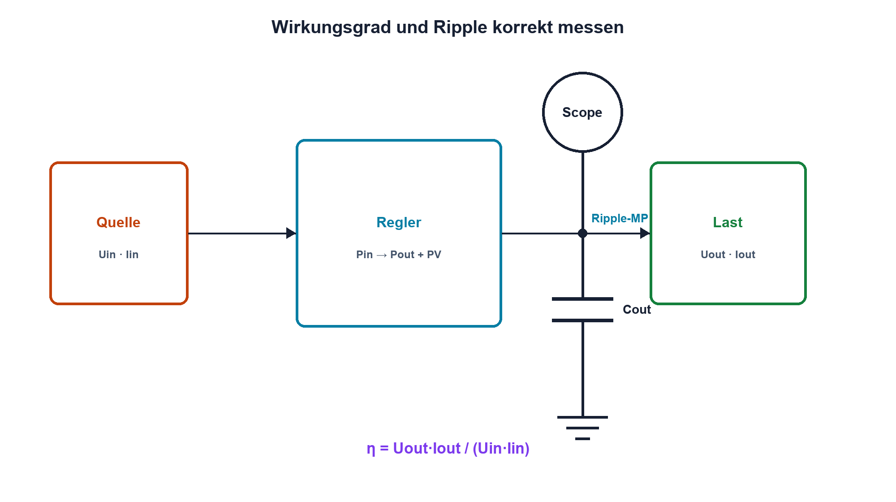

# 16.5 – Ripple und Wirkungsgrad

[← Zurück](04-schaltregler-buck-boost-und-buck-boost.md) · [Modulübersicht](README.md) · [Kursübersicht](../README.md) · [Weiter →](06-sicherungen-verpol-und-ueberspannungsschutz.md)

## Lernziele

Nach dieser Lektion kannst du:

- Ripple-Komponenten und Verlustpfade unterscheiden
- Wirkungsgrad aus Ein- und Ausgangsleistung bestimmen
- Ripple ohne Messschleifenfehler erfassen

## Einleitung

Eine korrekte Mittelspannung kann dennoch störenden Ripple und schlechte Effizienz besitzen. Ripple zeigt Energiespeicherung und Schaltvorgänge, der Wirkungsgrad fasst alle Verluste zusammen. Beide Messungen sind stark vom Aufbau abhängig.

<!-- context-expansion-2026 -->
Eine Stromversorgung ist eine dynamische Energiequelle für die gesamte Baugruppe. Eingang, Schutz, Regler, Leiterpfade, Kondensatoren und Lastprofil bilden ein System. Nennspannung allein genügt weder für die Dimensionierung noch für die Verifikation.

Beim Thema **Ripple und Wirkungsgrad** geht es deshalb nicht nur um eine einzelne Formel oder Definition. Entscheidend ist, wie sich das Prinzip im Schema erkennen, im Datenblatt beurteilen, im Aufbau messen und bei einer Abweichung systematisch überprüfen lässt.

## Theorie

<!-- theory-expansion-2026 -->
### Einordnung und Grundidee

Versorgungen werden über Leistungs- und Strompfade analysiert. Für jeden Betriebszustand werden Eingang, Ausgang, Verlust, Temperatur und gespeicherte Energie bilanziert. Dynamische Vorgänge wie Einschalten und Lastsprung werden zusätzlich im Zeitbereich gemessen.

### Ripplequellen

Ausgangsripple entsteht aus Spulenstromwelligkeit, Kondensatorkapazität, ESR, ESL und Regelschleife. Schaltspitzen kommen von parasitären Induktivitäten und schnellen Flanken. Sie sind nicht dasselbe wie die niederfrequente Welligkeit.

Der Wirkungsgrad ist `η = Pout/Pin`. Mit Gleichgrössen gilt `Pin = Uin·Iin` und `Pout = Uout·Iout`, sofern die Messwerte den zeitlichen Verlauf korrekt erfassen. Ruhestrom dominiert oft bei kleiner Last, Leitverluste bei grosser Last, Schalt- und Gateverluste bei hoher Frequenz.

### Messmethode

Ripple wird direkt über dem Ausgangskondensator mit kurzer Massefeder gemessen. Bandbreitenbegrenzung und AC-Kopplung werden dokumentiert. Lange Masseleitungen bilden eine Antenne und zeigen künstliche Spitzen.

Für Effizienz müssen Ein- und Ausgang gleichzeitig und möglichst nahe am Regler gemessen werden. Leitungsverluste ausserhalb der Messpunkte verfälschen das Ergebnis.

## Anwendungsfall

Typische elektronische Anwendungen und Baugruppen für dieses Thema sind:

- Effizienzvergleich bei mehreren Lastpunkten
- Beurteilung von Versorgungsgüte für ADC und Funk
- Nachweis von Wärme- und Energiebilanz

In einer konkreten Entwicklung wird nicht nur geprüft, ob die gewünschte Funktion grundsätzlich entsteht. Ebenso wichtig sind zulässige Grenzwerte, Toleranzen, Temperatur, Messbarkeit und das Verhalten bei Unterbruch, Kurzschluss oder falscher Ansteuerung.

## Anschauliches Beispiel

Der Mittelstand eines Wassertanks kann stimmen, obwohl die Oberfläche wellt. Der Wirkungsgrad sagt zusätzlich, wie viel Pumpenenergie als nutzbarer Durchfluss ankommt.

## Berechnungsbeispiel

Uin = 12,0 V, Iin = 0,245 A, Uout = 5,02 V und Iout = 0,500 A. `Pin = 2,94 W`, `Pout = 2,51 W`, `η ≈ 85,4 %`. Die Verlustleistung beträgt rund 0,43 W; Messunsicherheit ist mitzuführen.

## Praxisbezug

Vermesse Ripple, Wirkungsgrad und Temperatur bei mehreren Lastpunkten. Wiederhole Ripple mit langer Masseleitung als bewusst falsche Messung und dokumentiere den Unterschied.

## 🔗 Hardware ↔ Firmware

Lastmuster aus Sleep, Funk und PWM verändern Wirkungsgrad und Ripple. Firmwaretests müssen reale Betriebsprofile erzeugen. ADC-Telemetrie dient der Überwachung, für genaue Effizienzmessung sind kalibrierte externe Geräte nötig.

## Merksatz

> Ripple benötigt einen kontrollierten Hochfrequenz-Messaufbau; Wirkungsgrad benötigt korrekt platzierte Leistungs-Messpunkte.

## Häufige Fehler und Missverständnisse

- lange Tastkopfmasse für Ripple verwenden
- Schaltspitzen und Grundripple vermischen
- nur einen Lastpunkt messen
- Kabelverluste dem Regler zurechnen

## Zusammenfassung

Ripple beschreibt zeitliche Ausgangsabweichungen, Wirkungsgrad die Leistungsbilanz. Messpunkt, Bandbreite, Last und Temperatur gehören zum Ergebnis.

## Übungsfragen

1. Welche Bauteile erzeugen Rippleanteile?
2. Berechne η für 10 W Eingang und 8,7 W Ausgang.
3. Warum ist die Massefeder wichtig?
4. Wie erzeugt Firmware ein realistisches Lastprofil?

Weitere Aufgaben: [Übungen zu Modul 16](../uebungen/modul-16.md).

## Bezug Bildungsplan 2026

- Handlungskompetenzen: `a3`, `b1-LK03–04`, `b4`, `b5`, `c2`
- Nachweise: Ripple- und Wirkungsgradkennfeld mit dokumentiertem Messaufbau; [Kompetenzmatrix](../bildungsplan-2026/kompetenzmatrix.md)
