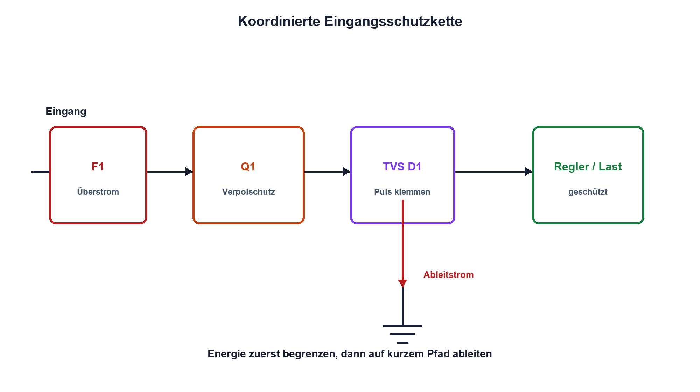

# 16.6 – Sicherungen, Verpol- und Überspannungsschutz

[← Zurück](05-ripple-und-wirkungsgrad.md) · [Modulübersicht](README.md) · [Kursübersicht](../README.md) · [Weiter →](07-entkopplung-lastsprung-und-messung.md)

## Lernziele

Nach dieser Lektion kannst du:

- Schutzkette nach Energie und Fehlerart strukturieren
- Sicherung, Verpolschutz und TVS funktional unterscheiden
- Normalbetrieb und Fehlerenergie nachweisen

## Einleitung

Ein Schutzbauteil allein schützt nicht gegen jeden Fehler. Sicherungen begrenzen langfristige Fehlerenergie, Verpolschutz sperrt falsche Polarität, TVS-Dioden klemmen kurze Überspannungen. Erst die koordinierte Kette besitzt einen kontrollierten Energiepfad.

<!-- context-expansion-2026 -->
Eine Stromversorgung ist eine dynamische Energiequelle für die gesamte Baugruppe. Eingang, Schutz, Regler, Leiterpfade, Kondensatoren und Lastprofil bilden ein System. Nennspannung allein genügt weder für die Dimensionierung noch für die Verifikation.

Beim Thema **Sicherungen, Verpol- und Überspannungsschutz** geht es deshalb nicht nur um eine einzelne Formel oder Definition. Entscheidend ist, wie sich das Prinzip im Schema erkennen, im Datenblatt beurteilen, im Aufbau messen und bei einer Abweichung systematisch überprüfen lässt.

## Theorie

<!-- theory-expansion-2026 -->
### Einordnung und Grundidee

Versorgungen werden über Leistungs- und Strompfade analysiert. Für jeden Betriebszustand werden Eingang, Ausgang, Verlust, Temperatur und gespeicherte Energie bilanziert. Dynamische Vorgänge wie Einschalten und Lastsprung werden zusätzlich im Zeitbereich gemessen.

### Schutzfunktionen

Eine Sicherung reagiert abhängig von Strom und Zeit; ihr I²t-Wert beschreibt Energiebeanspruchung bei kurzen Ereignissen. Eine rückstellende PTC begrenzt anders und besitzt hohen Kalt-/Heisswiderstand. Ein MOSFET-Verpolschutz reduziert Verlust gegenüber einer Seriendiode, benötigt aber richtige Body-Dioden-Orientierung und Gate-Schutz.

Eine TVS klemmt schnelle Überspannungen und wandelt Pulsenergie in Wärme. Standoff-, Breakdown- und Clamping-Spannung sind verschieden. Die vorgeschaltete Quellenimpedanz oder Sicherung begrenzt den Strom. Crowbar- und eFuse-Lösungen können dauerhafte Überspannung abschalten.

### Koordination und Layout

Schutz liegt am Eintrittspunkt. Ableitstrompfade sind kurz und führen nicht durch die empfindliche Masse. Bauteiltoleranzen, Temperatur, Pulsform, Wiederholrate und nachgeschaltete Absolute-Maximum-Grenzen werden gemeinsam geprüft.

## Anwendungsfall

Typische elektronische Anwendungen und Baugruppen für dieses Thema sind:

- Eingangsschutz von Fahrzeug-, Labor- und Industriegeräten
- Verpol- und Surge-Schutz
- Koordination von Sicherung, TVS und Abschaltung

In einer konkreten Entwicklung wird nicht nur geprüft, ob die gewünschte Funktion grundsätzlich entsteht. Ebenso wichtig sind zulässige Grenzwerte, Toleranzen, Temperatur, Messbarkeit und das Verhalten bei Unterbruch, Kurzschluss oder falscher Ansteuerung.

## Anschauliches Beispiel

Ein Gebäude besitzt Eingangstür, Überspannungsableiter und Hauptsicherung. Jedes Element behandelt einen anderen Fehler; ihre Reihenfolge entscheidet, wohin die Energie fliesst.

## Berechnungsbeispiel

Eine 24-V-Leitung steigt auf 40 V, die TVS klemmt bei 32 V und die Quelle besitzt 2 Ω. Der Pulsstrom ist näherungsweise `(40 − 32)/2 = 4 A`, die momentane TVS-Leistung `32 V·4 A = 128 W`. Zulässige Pulsdauer muss aus der Kurve folgen.

## Praxisbezug

Prüfe Verpolschutz zunächst strombegrenzt und ohne Last. Überspannungstests erfolgen nur mit dafür freigegebener Energiequelle oder Simulator. Miss Spannungen vor und nach jeder Schutzstufe.

## 🔗 Hardware ↔ Firmware

Firmware kann eFuse-Status, Unterspannung und Power Good auswerten. Sie kann weder Verpolung noch Überspannung während ausgeschaltetem Zustand verhindern. Hardware muss sicher begrenzen und abschalten.

## Merksatz

> Schutz funktioniert als koordinierte Kette mit definiertem Energie- und Rückstrompfad.

## Häufige Fehler und Missverständnisse

- Sicherung als schnellen Überspannungsschutz ansehen
- TVS nur nach Nennspannung auswählen
- MOSFET-Body-Diode falsch orientieren
- Ableitstrom durch Signalmassen führen

## Zusammenfassung

Sicherung, Verpolschutz, TVS und Abschaltung besitzen unterschiedliche Aufgaben. Dimensionierung und Layout müssen den realen Fehlerstrom beherrschen.

## Übungsfragen

1. Welche Aufgabe besitzt die Sicherung?
2. Warum unterscheiden sich VRWM und VC einer TVS?
3. Berechne Pulsstrom und Leistung für den gegebenen Fehler.
4. Welche Schutzfunktionen wirken ohne Firmware?

Weitere Aufgaben: [Übungen zu Modul 16](../uebungen/modul-16.md).

## Bezug Bildungsplan 2026

- Handlungskompetenzen: `a2–a3`, `b1-LK01–07`, `b2-LK03–04`, `b4-LK03`, `b5`
- Nachweise: begründete Schutzkette mit Puls- und Dauerfehlernachweis; [Kompetenzmatrix](../bildungsplan-2026/kompetenzmatrix.md)
