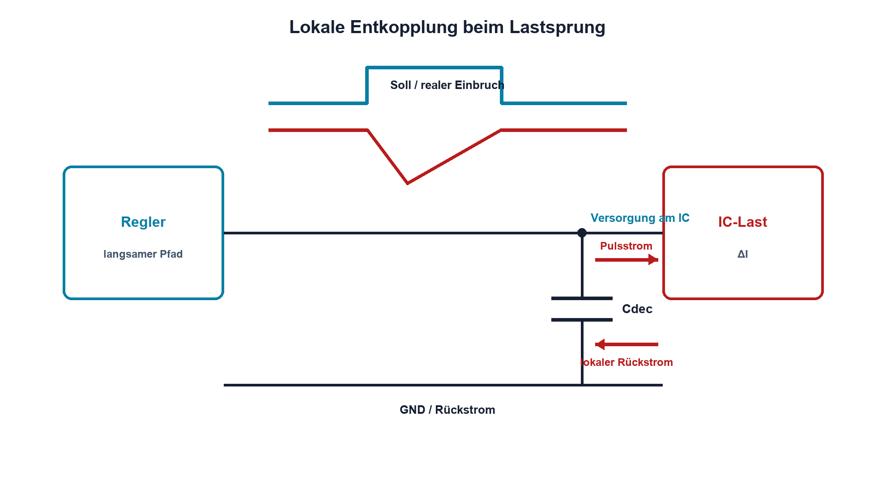

# 16.7 – Entkopplung, Lastsprung und Messung

[← Zurück](06-sicherungen-verpol-und-ueberspannungsschutz.md) · [Modulübersicht](README.md) · [Kursübersicht](../README.md) · [Weiter →](../17-messtechnik-grundlagen/README.md)

## Lernziele

Nach dieser Lektion kannst du:

- lokale Entkopplungsstrompfade erklären
- Lastsprung und Spannungsabweichung beurteilen
- Versorgungsrauschen reproduzierbar messen

## Warum ist das wichtig?

Ein Regler kann einen Lastsprung nicht ohne Verzögerung beantworten. Lokale Kondensatoren liefern den schnellen Strom, bis Regler und Zuleitung nachregeln. Entscheidend sind nicht nur Kapazitätswerte, sondern Schleifenfläche, ESR, ESL und Rückstrompfad.

## Theorie

### Schneller lokaler Strom

Beim Lastsprung liefert der nahe Abblockkondensator zunächst Ladung. Ideal gilt `ΔU = ΔI·Δt/C`. ESR erzeugt einen sofortigen Sprung `ΔUESR = ΔI·ESR`; ESL erzeugt bei schnellen Flanken `u = ESL·di/dt`.

Kleine Keramikkondensatoren liegen direkt an Versorgung und GND des IC. Grössere Stützkondensatoren bedienen langsamere Anteile. Kapazitätswert unter DC-Bias, Temperatur und Alterung ist relevant. Eine Ground Plane reduziert Induktivität, wenn Hin- und Rückweg nahe beieinander liegen.

### Lastsprungmessung

Die Last wird zwischen zwei bekannten Strömen geschaltet. Gemessen werden Einbruch, Überschwingen, Einschwingzeit und mögliche Oszillation direkt am Verbraucher. Eine zweite Messung am Regler trennt Leitungsabfall vom Regelverhalten. Stromsonde oder Shunt bestätigt den tatsächlichen Sprung.

## Anschauliches Beispiel

Ein kleiner Wassertank direkt an der Maschine liefert einen plötzlichen Bedarf sofort. Die weit entfernte Pumpe füllt ihn danach wieder – ein grosser Tank mit dünnem langem Rohr hilft bei schnellen Sprüngen wenig.

## Berechnungsbeispiel

Ein Lastsprung ΔI = 300 mA soll während 20 µs höchstens 100 mV kapazitiven Einbruch erzeugen. Ideal gilt `C ≥ 0,3 A·20 µs/0,1 V = 60 µF`. ESR, Toleranz und DC-Bias verlangen zusätzliche Reserve und parallele Keramikkondensatoren.

## Praxisbezug

Vermesse einen sicheren Regler mit elektronischer Last oder geschalteter Widerstandslast. Miss direkt am Lastanschluss mit Massefeder und gleichzeitig den Strom. Vergleiche unterschiedliche Kondensatorpositionen.

## 🔗 Hardware ↔ Firmware

Reale Lastsprünge entstehen durch CPU, Funk, Motor-PWM und Peripherie. Firmware kann Aktivierungen staffeln und Sleep-Modi nutzen. Brownout-Reset und Power-Good müssen dennoch einen sicheren Zustand herstellen.

## Merksatz

> Entkopplung ist ein kurzer lokaler Stromkreis; Kapazität ohne niedrige Induktivität und richtigen Messpunkt genügt nicht.

## Häufige Fehler und Missverständnisse

- nur nominelle Kapazität betrachten
- Kondensator weit vom Verbraucher platzieren
- Lastsprung ohne Strommessung beurteilen
- Reglerausgang und Verbraucherknoten gleichsetzen

## Zusammenfassung

Kondensatoren überbrücken die Reaktionszeit der Versorgung. ESR, ESL, Platzierung, Rückweg und reale Lastsprünge bestimmen die Spannungsqualität.

## Übungsfragen

1. Welche drei Effekte erzeugen ΔU?
2. Berechne C für 0,5 A, 10 µs und 50 mV.
3. Warum misst man direkt am Verbraucher?
4. Wie kann Firmware Lastsprünge reduzieren?

Weitere Aufgaben: [Übungen zu Modul 16](../uebungen/modul-16.md).

## Bezug Bildungsplan 2026

- Handlungskompetenzen: `a3`, `b1-LK01–07`, `b2-LK03–04`, `b4`, `b5`, `c1–c2`
- Nachweise: vollständige Lastsprung- und Entkopplungsmessung; [Kompetenzmatrix](../bildungsplan-2026/kompetenzmatrix.md)
