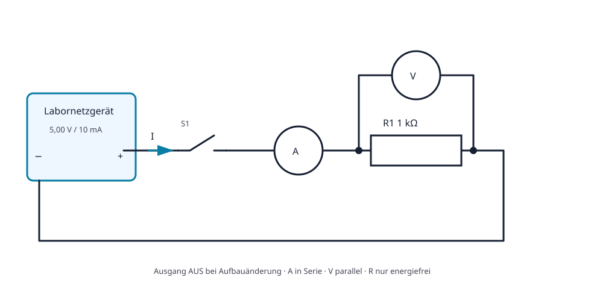

# Praxis 02 – Widerstand an einer Spannungsquelle berechnen, aufbauen und messen

[← Modul 02](../02-elektrische-grundgroessen/README.md) · [Kursübersicht](../README.md)

## Lernziel

Du sagst Strom und Leistung eines einfachen Stromkreises voraus, baust ihn sicher auf, misst U, I und R mit korrektem Anschluss und erklärst Soll-Ist-Abweichungen.

## Voraussetzungen

Module 00–02; sichere Bedienung von Netzgerät und DMM.

## Benötigtes Material

Steckbrett, R1 = 1 kΩ (mindestens 0,25 W), Leitungen, Schalter oder Steckbrücke.

## Benötigte Messgeräte

Strombegrenztes 0–5-V-Labornetzgerät und abgesichertes Digitalmultimeter; idealerweise zweites DMM für gleichzeitige U-/I-Messung.

## Schaltung / Messaufbau

## Sicherheitshinweise

Maximal 5 V und 20 mA. Aufbau nur spannungsfrei ändern. Strommessung nie parallel zur Quelle. Widerstand nur energiefrei messen. Nach Strommessung Leitung sofort in V/Ω-Buchse zurückstecken.

## Vorbereitung

Markiere Plus, GND, technischen Strompfeil, Mess- und Bezugspunkte. Kontrolliere DMM-Buchsen und Netzgerät bei Ausgang AUS.

## Berechnung

Miss R1 spannungsfrei. Berechne für 1, 2, 3, 4 und 5 V jeweils I und P. Ergänze einen Bereich aus Widerstandstoleranz und Quellenabweichung.

## Aufbau

Verdrahte Quelle, R1 und Rückleiter. Lass die Aufbaufreigabe gegen das Schema prüfen. Stelle 0 V und 10 mA Stromgrenze ein.

## Durchführung

Erhöhe U in 1-V-Schritten. Vor jedem Schritt: I und P vorhersagen. Danach U parallel und I in Serie messen. Schalte vor jeder Änderung des Strompfads aus.

## Messung

Erfasse tatsächliche Quellspannung, Widerstandsspannung und Strom. Berechne zusätzlich `R = U/I` und `P = U·I`.

## Messwerte

| U eingestellt | U gemessen | I Soll | I Ist | R aus U/I | P Ist | Abweichung / Erklärung |
|---:|---:|---:|---:|---:|---:|---|
| 1 V |  |  |  |  |  |  |
| 2 V |  |  |  |  |  |  |
| 3 V |  |  |  |  |  |  |
| 4 V |  |  |  |  |  |  |
| 5 V |  |  |  |  |  |  |

## Auswertung

Zeichne I über U. Prüfe Linearität, Steigung, grösste Abweichung und mögliche Messgerätebelastung. Formuliere ein Ergebnis mit Akzeptanzbereich statt nur «stimmt».

## Fragen

1. Warum ist der Strom nahezu proportional zu U? 2. Welche Spannung verursacht das Amperemeter selbst? 3. Wie ändert sich P bei doppelter U? 4. Was geschieht bei offenem Rückleiter?

## Was solltest du beobachtet haben?

Eine annähernd gerade Kennlinie, gleichen Strom im Serienpfad und kleine, erklärbare Abweichungen durch reale Werte und Messgeräte.

## Bezug zur Theorie

Lektionen 02.1–02.7; besonders `b1-LK02–03`, `b4-LK01–10`.

## 🔗 Hardware ↔ Firmware

Wiederhole gedanklich den Versuch mit einem GPIO als Quelle. Welche Pin-Konfiguration, Stromgrenze und Messung wären nötig? Die elektrische Last bleibt auch bei logisch korrekter Firmware real.
