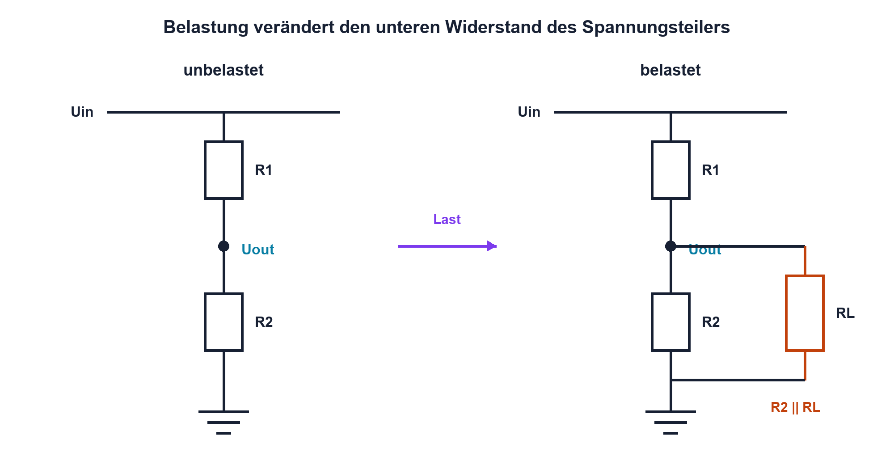
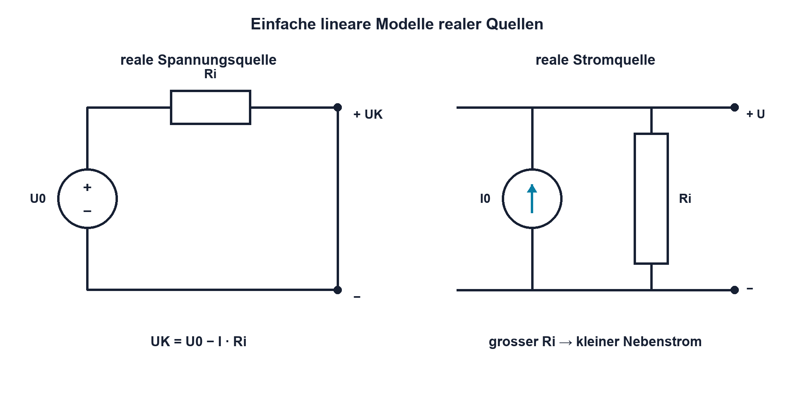

# Praxis 03 – Spannungsteiler vermessen und Innenwiderstand bestimmen

[← Modul 03](../03-gleichstromnetzwerke/README.md) · [Praxisübersicht](README.md) · [Kursübersicht](../README.md)

## Lernziel

Du sagst das Verhalten eines unbelasteten und belasteten Spannungsteilers voraus, misst die Knotenspannungen und bestimmst anschliessend den Innenwiderstand einer sicheren Modellquelle aus zwei Betriebspunkten. Du dokumentierst Abweichungen als überprüfbare Hypothesen.

## Benötigtes Material

- Steckbrett und Leitungen
- $R_1=10~\mathrm{k}\Omega$, $R_2=10~\mathrm{k}\Omega$, jeweils 1 %
- Lastwiderstände 100 kΩ, 22 kΩ und 10 kΩ, jeweils 1 %
- Modellquelle: $R_i=1.0~\mathrm{k}\Omega$ in Reihe mit einer 5-V-Versorgung
- Lastwiderstände 10 kΩ und 4.7 kΩ für die Modellquelle

## Benötigte Messgeräte

- strombegrenztes 0–5-V-Labornetzgerät
- Digitalmultimeter mit dokumentiertem Eingangswiderstand im Spannungsbereich
- optional zweites DMM zum Vergleich der Eingangsimpedanz

## Schaltung / Messaufbau

Teil A verwendet den Spannungsteiler aus Lektion 03.3. $R_1$ liegt von 5 V nach $U_{\mathrm{out}}$, $R_2$ von $U_{\mathrm{out}}$ nach GND. Die Last wird jeweils parallel zu $R_2$ eingesetzt.

Teil B bildet eine reale Quelle aus der 5-V-Versorgung und einem sichtbaren Serienwiderstand von 1.0 kΩ. Gemessen wird ausschliesslich mit sicheren Widerstandslasten – kein Kurzschlussversuch.

## Sicherheitshinweise

- Ausschliesslich berührungssichere Kleinspannung bis 5 V verwenden.
- Stromgrenze zunächst auf 20 mA einstellen.
- Widerstände und Verdrahtung nur bei ausgeschaltetem Ausgang ändern.
- Vor jedem Einschalten Widerstandswerte und Kurzschlussfreiheit prüfen.
- Das Amperemeter niemals parallel zur Quelle anschliessen.
- Abbrechen, wenn ein Bauteil warm wird, die Strombegrenzung unerwartet anspricht oder ein Messwert deutlich ausserhalb des vorhergesagten Bereichs liegt.

## Vorbereitung

1. Zeichne beide Schaltungen mit Referenzbezeichnern und Messpunkten.
2. Miss alle Widerstände einzeln im spannungsfreien Zustand.
3. Notiere den Eingangswiderstand des Voltmeters aus der Geräteunterlage.
4. Sage qualitativ voraus, in welche Richtung $U_{\mathrm{out}}$ mit kleiner werdender Last geht.
5. Berechne alle Sollwerte vor dem Aufbau.

## Berechnung

Für Teil A berechnest du bei **5.000 V** Eingang die Ausgangsspannung für:

- Leerlauf beziehungsweise nur das Voltmeter
- $R_L=100~\mathrm{k}\Omega$
- $R_L=22~\mathrm{k}\Omega$
- $R_L=10~\mathrm{k}\Omega$

Für den belasteten Spannungsteiler gilt:

$$
R_{2L} = R_2\parallel R_L
$$

$$
U_{\mathrm{out}} =
U_{\mathrm{in}}
\frac{R_{2L}}
     {R_1+R_{2L}}
$$

Berücksichtige bei der genauesten Rechnung den DMM-Eingangswiderstand als zusätzliche Parallellast. Dann wird der wirksame untere Zweig aus $R_2$, $R_L$ und dem DMM-Eingangswiderstand gebildet.

Bestimme ausserdem den Ausgangswiderstand:

$$
R_{\mathrm{out}} = R_1\parallel R_2
$$

Für Teil B berechnest du aus $U_0=5.000~\mathrm{V}$, $R_i=1.0~\mathrm{k}\Omega$ und jeder Last den Strom sowie die erwartete Klemmenspannung:

$$
I =
\frac{U_0}
     {R_i+R_L}
$$

$$
U_K = U_0-I\cdot R_i
$$

## Aufbau

Baue zuerst nur Teil A. Verwende kurze Leitungen, einen gemeinsamen GND-Knoten und gut sichtbare Messpunkte. Führe eine Sichtprüfung und eine Widerstandsmessung zwischen Versorgung und GND durch. Schalte danach mit Strombegrenzung ein.

Teil B wird erst aufgebaut, nachdem Teil A ausgeschaltet und dokumentiert ist. Der Serienwiderstand der Modellquelle muss eindeutig erkennbar bleiben, damit er nicht versehentlich überbrückt wird.

## Durchführung

### Teil A – Belasteter Spannungsteiler

1. Stelle 5.000 V ein und kontrolliere die Spannung direkt am Teilereingang.
2. Miss $U_{\mathrm{out}}$ zunächst ohne zusätzlichen Lastwiderstand.
3. Schalte nacheinander 100 kΩ, 22 kΩ und 10 kΩ parallel zu $R_2$.
4. Schalte vor jeder Änderung den Ausgang aus.
5. Vergleiche jeden Messwert sofort mit der Vorhersage, ändere aber nicht mehrere Dinge gleichzeitig.

### Teil B – Innenwiderstand

1. Miss die Leerlaufspannung der Modellquelle.
2. Schliesse 10 kΩ an, miss Klemmenspannung und berechne den Laststrom:

$$
I_L = \frac{U_K}{R_L}
$$

3. Wiederhole die Messung mit 4.7 kΩ.
4. Bestimme den Innenwiderstand für jeden Lastpunkt:

$$
R_i =
\frac{U_0-U_K}
     {I_L}
$$

Zusätzlich kann der Innenwiderstand aus der Steigung zwischen zwei Lastpunkten bestimmt werden:

$$
R_i =
\left|
\frac{\Delta U_K}
     {\Delta I_L}
\right|
$$

5. Vergleiche das Resultat mit dem einzeln gemessenen 1-kΩ-Serienwiderstand.

## Messung

Spannungen werden parallel zu den eindeutig benannten Knoten gemessen. Ströme werden bevorzugt aus dem Spannungsabfall an bekannten Widerständen berechnet, damit der Pfad nicht aufgetrennt und durch die Burden Voltage des Amperemeters verändert wird.

## Messwerte

### Teil A

| Last | berechnetes $U_{\mathrm{out}}$ | gemessenes $U_{\mathrm{out}}$ | Abweichung | Bedingung |
|---|---:|---:|---:|---|
| keine Zusatzlast | | | | DMM-Eingang: |
| 100 kΩ | | | | |
| 22 kΩ | | | | |
| 10 kΩ | | | | |

### Teil B

| Last | $U_K$ Soll | $U_K$ Ist | Laststrom | berechnetes $R_i$ |
|---|---:|---:|---:|---:|
| Leerlauf | | | 0 A | – |
| 10 kΩ | | | | |
| 4.7 kΩ | | | | |

## Auswertung

- Zeichne $U_{\mathrm{out}}$ aus Teil A über dem Lastwiderstand auf einer sinnvollen Achse.
- Erkläre die Richtung und Grösse jeder Änderung mit dem Parallelersatz.
- Gib für Teil B Mittelwert und Streuung der bestimmten Innenwiderstände an.
- Ordne Abweichungen den Kategorien Bauteiltoleranz, Quellenabweichung, Messgerätebelastung, Kontakt und Rundung zu.
- Entscheide, ob das lineare Quellenmodell im untersuchten Bereich ausreichend ist.

## Fragen

1. Bei welcher Last wird die DMM-Eingangsimpedanz relevant?
2. Weshalb ist der direkte Kurzschluss keine geeignete Standardmethode zur Innenwiderstandsmessung?
3. Welche Messung zeigt, ob der Eingang des Teilers tatsächlich 5.000 V bleibt?
4. Wie würde ein aktivierter interner MCU-Pull-down den Teilerausgang verändern?

## Was solltest du beobachtet haben?

Mit kleinerem Lastwiderstand sinkt die Ausgangsspannung. Der berechnete Parallelersatz erklärt die Messwerte innerhalb der kombinierten Toleranzen. Die Modellquelle zeigt unter stärkerer Last eine kleinere Klemmenspannung; aus beiden Lastpunkten sollte ungefähr der eingebaute Innenwiderstand von 1.0 kΩ folgen.

## Bezug zur Theorie

Die Messung verbindet Reihen-/Parallelschaltung, belasteten Spannungsteiler, reales Quellenmodell, Thévenin-Ersatzschaltung und systematische Soll-Ist-Auswertung aus den Lektionen 03.1 bis 03.7.

## 🔗 Hardware ↔ Firmware

Übertrage Teil A gedanklich auf einen ADC-Eingang. Dokumentiere Teilerfaktor, maximalen ADC-Pegel, Ausgangswiderstand und mögliche interne Pull-up/down-Konfiguration. Firmware muss die reale Skalierung verwenden; ein falscher Pinmodus erscheint elektrisch als zusätzliche Last.

## Bezug Bildungsplan 2026

- Handlungskompetenzen und Leistungskriterien: `a3`, `b1-LK02–03`, `b1-LK06`, `b1-LK08`, `b4-LK01–10`, `b5-LK01–05`
- Vollständige Zuordnung: [Kompetenzmatrix](../bildungsplan-2026/kompetenzmatrix.md)
