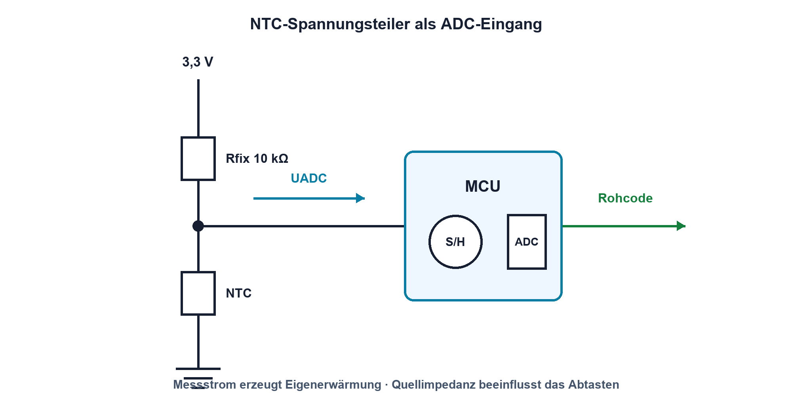
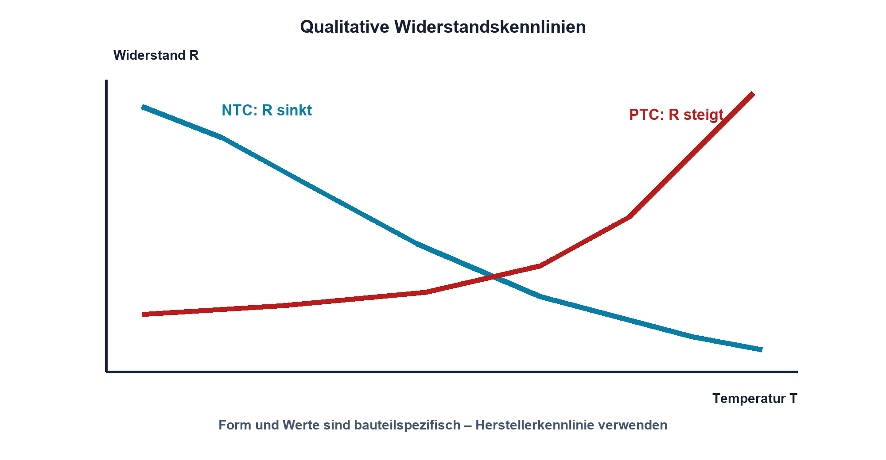

# Praxis 04 – NTC-Kennlinie aufnehmen

[← Modul 04](../04-widerstaende-sensoren/README.md) · [Praxisübersicht](README.md) · [Kursübersicht](../README.md)

## Lernziel

Du nimmst die Widerstandskennlinie eines konkreten NTC bei mehreren Temperaturen auf, beurteilst Eigenerwärmung und thermisches Einschwingen und entwickelst aus den Messdaten einen ADC-tauglichen Spannungsteiler. Messdaten und Bauteilidentität werden so dokumentiert, dass der Versuch wiederholbar ist.

## Benötigtes Material

- Mess-NTC, bevorzugt 10 kΩ bei 25 °C, mit verfügbarem Datenblatt
- Präzisions-Festwiderstand nahe `R_25`, beispielsweise 10 kΩ mit 0,1 %
- Steckbrett oder stabile Klemmen, isolierte Leitungen
- kleine Gefässe für Wasserbäder oder ein freigegebener Temperaturkalibrator
- Eis, Wasser auf Raumtemperatur und erwärmtes Wasser
- Hilfsmittel zur sicheren Positionierung, ohne elektrische Anschlüsse einzutauchen

## Benötigte Messgeräte

- DMM für Widerstand beziehungsweise Spannung
- Referenzthermometer mit geeigneter Genauigkeit und dokumentierter Fühlerposition
- strombegrenztes 3,3-V-Labornetzgerät für den Teiler
- optional zweites DMM zur gleichzeitigen Spannungs- und Widerstandsmessung

## Schaltung / Messaufbau

Für die reine Kennlinie wird der NTC spannungsfrei mit dem Ohmmeter gemessen. Für die zweite Phase liegt ein 10-kΩ-Festwiderstand von 3,3 V zum Ausgang und der NTC vom Ausgang nach GND.

Die erwartete Form wird mit der qualitativen Kennlinie verglichen:

## Sicherheitshinweise

- Keine Netzspannung und keine offenen Heizquellen verwenden.
- Wasser und elektrische Geräte räumlich trennen; nur der dafür geeignete, isolierte Sensorkörper darf mit dem Bad in Kontakt kommen.
- Heisses Wasser so begrenzen, dass keine Verbrühungsgefahr entsteht; Gefäss standsicher aufstellen.
- Anschlüsse vor Kondensation und Kurzschluss schützen.
- Den NTC nicht am Kabel aus dem Bad ziehen und Temperaturgrenzen des Datenblatts einhalten.
- Bei beschädigter Isolation, instabilem Aufbau oder Flüssigkeit nahe Messgeräten Versuch abbrechen.

## Vorbereitung

1. Identifiziere Hersteller, Typ, `R_25`, Toleranz, B-Wert mit Temperaturbereich und zulässige Temperatur.
2. Ermittle den ungefähren Messstrom des Ohmmeters oder prüfe, dass die Eigenerwärmung für das Lernziel vernachlässigbar ist.
3. Lege mindestens fünf Temperaturpunkte fest, beispielsweise ungefähr 5, 20, 30, 40 und 50 °C.
4. Definiere ein Stabilitätskriterium, etwa weniger als 0,2 K Temperaturänderung und weniger als 0,5 % Widerstandsänderung während 30 s.
5. Sage vorab voraus, wie Widerstand und Teilerspannung mit der Temperatur verlaufen.

## Berechnung

Berechne mit den Datenblattwerten oder der bereitgestellten Kennlinie die erwarteten NTC-Widerstände an den Messpunkten. Falls das Beta-Modell verwendet wird, müssen alle Temperaturen in Kelvin eingesetzt werden.

Für die Teilerschaltung gilt bei NTC gegen GND:

`U_out = 3,3 V · R_NTC / (R_fix + R_NTC)`

Berechne ausserdem den NTC-Strom und die Eigenerwärmungsleistung `P_NTC = U_NTC²/R_NTC` am kältesten und wärmsten Messpunkt. Vergleiche sie mit den Angaben zur Dissipationskonstante, sofern diese im Datenblatt vorhanden sind.

## Aufbau

Fixiere NTC und Referenzfühler möglichst nahe beieinander, ohne dass sie sich elektrisch oder thermisch ungünstig beeinflussen. Die Fühler dürfen Gefässwand und Boden nicht berühren. Leitungen werden zugentlastet; Anschlussstellen bleiben trocken.

## Durchführung

1. Beginne beim kältesten Punkt und warte, bis das Stabilitätskriterium erfüllt ist.
2. Notiere Temperatur, NTC-Widerstand, Zeit und Messbereich.
3. Wiederhole für alle Temperaturpunkte. Rühre das Wasser vorsichtig um, damit keine starken Temperaturschichten entstehen.
4. Wiederhole mindestens einen Punkt beim Abkühlen. So erkennst du Verzögerung oder ungenügendes Einschwingen.
5. Baue danach den 3,3-V-Spannungsteiler auf und miss die Ausgangsspannung an mindestens drei stabilen Temperaturpunkten.

## Messung

Widerstandsmessungen erfolgen ausschliesslich am spannungsfreien Sensor. Im Spannungsteiler wird kein Ohmmeter parallel angeschlossen. Temperatur und elektrischer Wert werden möglichst gleichzeitig aufgenommen, weil der Sensor während einer langsamen Temperaturänderung sonst unterschiedlichen Zuständen zugeordnet würde.

## Messwerte

| Punkt | Temperatur / °C | Temperatur / K | `R_NTC` Soll | `R_NTC` Ist | `U_out` Soll | `U_out` Ist | stabil seit |
|---:|---:|---:|---:|---:|---:|---:|---|
| 1 | | | | | | | |
| 2 | | | | | | | |
| 3 | | | | | | | |
| 4 | | | | | | | |
| 5 | | | | | | | |

## Auswertung

- Stelle `R_NTC` über der Temperatur dar; verwende bei Bedarf eine logarithmische Widerstandsachse.
- Vergleiche Messwerte mit Datenblatttabelle oder Beta-Modell und berechne die relative Abweichung.
- Stelle `U_out` über der Temperatur dar und markiere den nutzbaren ADC-Bereich.
- Schätze Eigenerwärmung und erkläre, ob sie gegenüber der beobachteten Abweichung relevant sein kann.
- Leite mögliche Diagnosegrenzen für Unterbruch und Kurzschluss ab.
- Dokumentiere, ob der beim Abkühlen wiederholte Punkt innerhalb der Messunsicherheit übereinstimmt.

## Fragen

1. Warum müssen Temperatur und Widerstand erst nach dem Einschwingen abgelesen werden?
2. Wie verändert ein kleinerer Festwiderstand Empfindlichkeit und Eigenerwärmung?
3. Welche Fehler entstehen, wenn Celsius direkt in das Beta-Modell eingesetzt wird?
4. Welche zusätzlichen Prüfungen wären für einen produktiven Temperatursensor erforderlich?

## Was solltest du beobachtet haben?

Der NTC-Widerstand fällt nichtlinear mit steigender Temperatur. Bei NTC gegen GND sinkt auch die Teilerspannung. Messwerte nähern sich der Datenblattkennlinie, weichen aber durch Toleranz, Referenzthermometer, thermische Kopplung, Eigenerwärmung und noch nicht vollständig erreichten Gleichgewichtszustand ab.

## Bezug zur Theorie

Der Versuch verbindet Widerstandstoleranz, Temperaturkoeffizient, Verlustleistung, NTC-Kennlinie und belasteten Spannungsteiler. Die dokumentierten Daten bilden den ersten messbaren Baustein von Projekt A.

## 🔗 Hardware ↔ Firmware

Lege für eine spätere Firmware fest: ADC-Referenz, Teilerorientierung, Umrechnung vom ADC-Code zur Spannung, Berechnung des NTC-Widerstands, Tabellen- oder Modellverfahren und Diagnosegrenzen. Bewahre Rohcode und Zwischenwerte bei der Fehlersuche auf; nur die fertige Temperaturanzeige reicht zur Ursachenanalyse nicht aus.

## Bezug Bildungsplan 2026

- Handlungskompetenzen und Leistungskriterien: `a3`, `b1-LK01–04`, `b1-LK06`, `b4-LK01–10`, `b5-LK01–05`, `c1–c2`
- Projektnachweis: Projekt A – Sensorcharakterisierung und Schnittstellenparameter
- Vollständige Zuordnung: [Kompetenzmatrix](../bildungsplan-2026/kompetenzmatrix.md)
