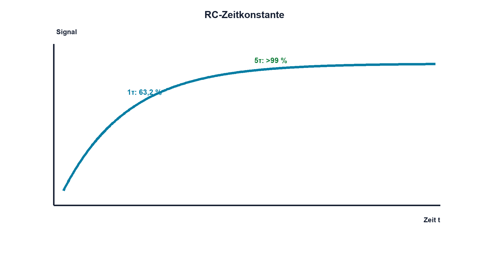

# Praxis 05 – RC-Ladekurve mit dem Oszilloskop messen

[← Modul 05](../05-kondensatoren/README.md) · [Praxisübersicht](README.md) · [Kursübersicht](../README.md)

## Lernziel

Du berechnest τ, misst Lade- und Entladekurve und erklärst Abweichungen durch Toleranz, Generator- und Tastkopfeinfluss.

## Benötigtes Material

R1 = 10 kΩ, C1 = 100 nF Folie oder geeignete Keramik, Steckbrett, Leitungen.

## Benötigte Messgeräte

Funktionsgenerator mit 0–3,3-V-Rechteck und Oszilloskop mit 10:1-Tastköpfen.

## Schaltung / Messaufbau

R1 liegt in Serie vom Generator zu Uout, C1 von Uout nach GND. Kanal 1 misst Uin, Kanal 2 Uout.

## Sicherheitshinweise

Nur SELV-Kleinspannung; gemeinsame Masse von Generator und Oszilloskop vorab prüfen. C1 vor Widerstandsmessungen entladen.

## Vorbereitung und Berechnung

Berechne τ, den 63,2-%-Pegel und eine Frequenz, deren Halbperiode mindestens 5τ beträgt. Berücksichtige 50 Ω Generatorausgang näherungsweise.

## Aufbau und Durchführung

Spannungsfrei aufbauen und Masse zuerst verbinden. Mit 10:1-Tastköpfen kompensiert und gleicher Bezugsmessung starten. Trigger auf Uin. Miss uC bei 1τ, 3τ und 5τ sowie die Zeit bis 63,2 %. Wiederhole mit verdoppeltem R oder C.

## Messwerte

| Aufbau | τ Soll | τ aus 63,2 % | uC(τ) | uC(3τ) | Bedingung |
|---|---:|---:|---:|---:|---|
| Grundaufbau | | | | | |
| Variation | | | | | |

## Auswertung

Vergleiche Kurvenform und τ. Berechne relative Abweichung und ordne sie Bauteiltoleranz, Generatorwiderstand, Tastkopf und Ablesung zu.

## Fragen

Warum ist die Kurve nicht linear? Weshalb muss die Halbperiode lang genug sein? Wie beeinflusst ein 1:1-Tastkopf das Netzwerk?

## Was solltest du beobachtet haben?

Nach 1τ sind etwa 63,2 %, nach 3τ etwa 95 % und nach 5τ über 99 % der Änderung erreicht. Doppelte R oder C verdoppeln τ.

## Bezug zur Theorie

Lektionen 05.1–05.4 und 05.6 verbinden Ladung, Strom, Exponentialverlauf und Messbelastung.

## 🔗 Hardware ↔ Firmware

Ein GPIO-Rechteck kann den Generator ersetzen, sofern Pinbelastung und Schutz eingehalten werden. Timerregister bestimmen T; Oszilloskop und RC-Netz zeigen die reale Antwort.

## Bezug Bildungsplan 2026

`a3`, `b1-LK02–03`, `b1-LK06`, `b4-LK01–10`, `c1–c2`; Details: [Kompetenzmatrix](../bildungsplan-2026/kompetenzmatrix.md).
