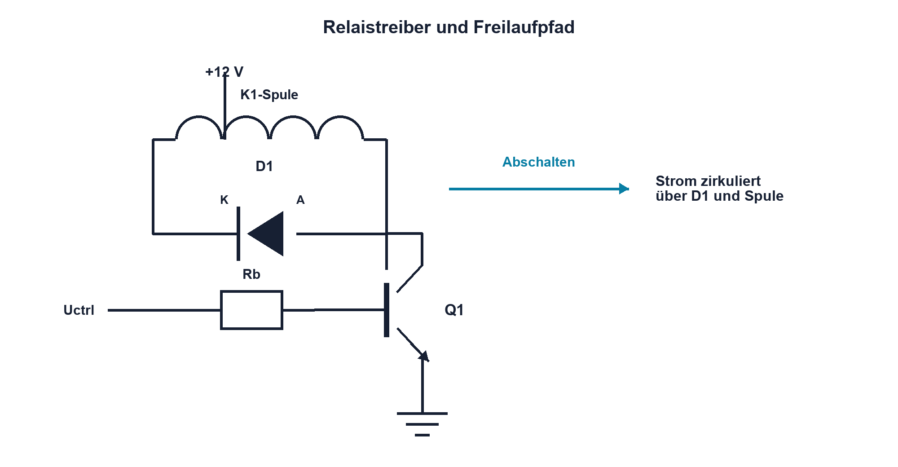

# Praxis 06 – Relaisspule schalten und Abschaltspannung messen

[← Modul 06](../06-spulen-elektromagnetismus/README.md) · [Praxisübersicht](README.md) · [Kursübersicht](../README.md)

## Lernziel

Du baust einen sicheren Low-Side-Relaistreiber, misst Spulenstrom und vergleichst Abschaltverläufe mit Diode und freigegebener höherer Klemme.

## Benötigtes Material und Messgeräte

Kleinspannungsrelais 5 oder 12 V mit Datenblatt, geeigneter NPN-Transistor, Basiswiderstand, Basis-Emitter-Pulldown, Freilaufdiode, 1-Ω-Shunt geeigneter Leistung, optionale TVS-Klemme, strombegrenztes Netzgerät und Oszilloskop. Ein freigegebener Logik-MOSFET mit Gatewiderstand und Gate-Pulldown ist als spätere Vergleichsvariante möglich.

## Schaltung / Messaufbau

Spule von +U zum Kollektor, NPN-Transistor als Low-Side-Schalter nach GND, Diode antiparallel zur Spule mit Kathode an +U. Der Basiswiderstand begrenzt den GPIO-Strom; der Pulldown sorgt bei hochohmigem Steuersignal für einen definierten Aus-Zustand. Der Shunt liegt im sicheren Low-Side-Messpfad.

## Sicherheitshinweise

Nur Kleinspannung und unbelastete beziehungsweise sichere Kontakte verwenden. Die Variante «ohne Diode» ist nur mit definierter alternativer Klemme zulässig. Tastkopfgrenze und Massebezug vorab prüfen.

## Vorbereitung und Berechnung

Berechne Spulenstrom, Wicklungsleistung und EL mit Datenblatt-L. Fehlt L, wird keine Energiezahl erfunden. Wähle einen erzwungenen Stromverstärkungsfaktor für sicheren Schaltbetrieb, berechne daraus Basisstrom und Basiswiderstand und prüfe die GPIO-Grenze. Leite erwartete Shuntspannung und zulässige Kollektor-Emitter-Spannung ab.

## Aufbau und Durchführung

Zuerst spannungsfrei Diodenpolung, Basisbeschaltung und Kurzschlussfreiheit prüfen. Stromgrenze knapp oberhalb des Sollstroms einstellen. Kanal 1 misst den Kollektor, Kanal 2 den Shunt. Zuerst mit Diode schalten, danach optional mit freigegebener Klemme. Spitzenwert, Stromabfallzeit und Kontaktabfall vergleichen.

## Messwerte

| Schutz | I Spule | UCE max | Abfallzeit Strom | Kontaktabfall | Bedingung |
|---|---:|---:|---:|---:|---|
| Diode | | | | | |
| höhere Klemme | | | | | |

## Auswertung und Fragen

Erkläre Energiepfad und Zielkonflikt aus Spannung und Abfallzeit. Welche Grenzwerte schützen Transistor und Diode? Warum ist ungeschütztes Abschalten kein regulärer Vergleich?

## Was solltest du beobachtet haben?

Die Diode begrenzt die Kollektorspitze stark und führt zu langsamem Stromabfall. Eine höhere kontrollierte Klemme beschleunigt den Abbau bei höherer Transistorbelastung.

## Bezug zur Theorie

Lektionen 06.2–06.5 und 06.7.

## 🔗 Hardware ↔ Firmware

Timer oder GPIO erzeugt das Steuersignal. Reset-Pegel, maximale Schaltfrequenz und Kontaktentprellung werden mit realen Strömen und Zeiten abgestimmt.

## Bezug Bildungsplan 2026

`a3`, `b1-LK01–06`, `b4-LK01–10`, `b5`, `c1–c2`; Details: [Kompetenzmatrix](../bildungsplan-2026/kompetenzmatrix.md).
