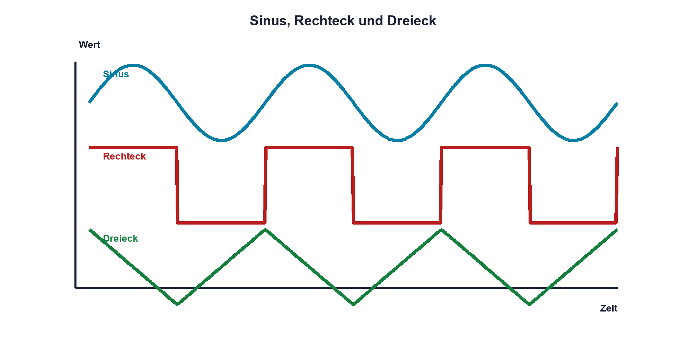

# Praxis 07 – Signale mit Funktionsgenerator und Oszilloskop untersuchen

[← Modul 07](../07-periodische-signale/README.md) · [Praxisübersicht](README.md) · [Kursübersicht](../README.md)

## Lernziel

Du beschreibst Sinus, Rechteck und Dreieck vollständig mit f, T, Pegeln, RMS, Tastgrad und Phase und beurteilst Messgeräteeinflüsse.

## Benötigtes Material und Messgeräte

Funktionsgenerator, Zweikanal-Oszilloskop, kompensierte 10:1-Tastköpfe, 1-kΩ-Last und bei Bedarf 50-Ω-Abschluss geeigneter Leistung.

## Schaltung / Messaufbau

Generatorausgang wird gleichzeitig mit Oszilloskop und definierter Last verbunden. Für Phase dient ein sicheres RC-Netz als zweiter Kanal.

## Sicherheitshinweise

Gerätemassen sind häufig geerdet und miteinander verbunden. Keine Verbindung zu Netzpotentialen. Generatorangabe «High Z» oder «50 Ω» muss zum realen Abschluss passen.

## Vorbereitung und Durchführung

Plane 1-kHz-Signale mit 2 Vpp und 1,65 V Offset. Sage Umax, Umin und Sinus-Ueff voraus. Miss je Form T, f, Umax, Umin, Upp und RMS. Beim Rechteck zusätzlich Tastgrad und Flankenzeit. Messe danach Δt und φ am RC-Netz für zwei Frequenzen.

## Messwerte

| Form | f | Upp | Offset | Ueff | D / Flanke | Bedingung |
|---|---:|---:|---:|---:|---|---|
| Sinus | | | | | | |
| Rechteck | | | | | | |
| Dreieck | | | | | | |

## Auswertung und Fragen

Vergleiche RMS mit der jeweiligen Signalform. Erkläre Änderungen durch 50-Ω-Abschluss. Weshalb genügt 1 kHz nicht zur Bandbreitenbeschreibung eines schnellen Rechtecks?

## Was solltest du beobachtet haben?

Gleiche Upp führt je nach Signalform zu anderem RMS. Offset verschiebt Extremwerte. Die Phase des RC-Netzes ändert sich mit Frequenz.

## Bezug zur Theorie

Lektionen 07.1–07.7.

## 🔗 Hardware ↔ Firmware

Vergleiche optional ein Timer-PWM-Signal mit der Generatorvorgabe. Prescaler, Periodenregister und Comparewert werden dem real gemessenen f, D und Pegel gegenübergestellt.

## Bezug Bildungsplan 2026

`a3`, `b1-LK02–03`, `b4-LK01–10`, `b5`, `c1–c2`; Details: [Kompetenzmatrix](../bildungsplan-2026/kompetenzmatrix.md).
