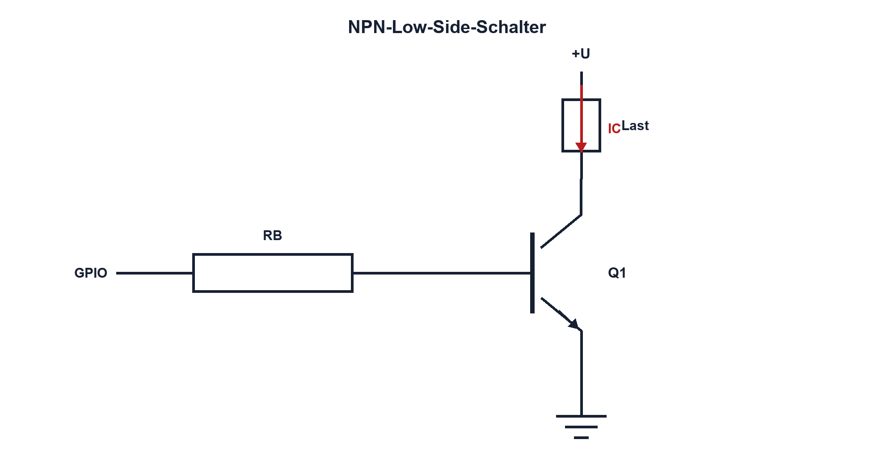

# Praxis 10 – LED oder Relais über BJT schalten

[← Modul 10](../10-bipolartransistoren/README.md) · [Praxisübersicht](README.md) · [Kursübersicht](../README.md)

## Lernziel

Du dimensionierst einen NPN-Low-Side-Schalter, misst Basis- und Kollektorstrom, weist Sättigung nach und erklärst die Wirkung einer Freilaufdiode bei einer Relaisspule.

## Benötigtes Material

NPN-Transistor mit Datenblatt, LED mit Vorwiderstand oder Kleinspannungsrelais, Basiswiderstände, Basis-Emitter-Pulldown, Freilaufdiode, 10-Ω- oder geeigneter Strom-Shunt und Steckbrett.

## Benötigte Messgeräte

Strombegrenztes Labornetzgerät, DMM, Zweikanal-Oszilloskop und 10:1-Tastköpfe.

## Schaltung / Messaufbau

Last von +U an den Kollektor von Q1, Emitter über den freigegebenen Shunt an GND. GPIO-/Generatorersatz speist die Basis über RB; Pulldown von Basis nach Emitter. Bei Relais liegt D1 antiparallel zur Spule, Kathode an +U.

## Sicherheitshinweise

Nur SELV-Kleinspannung. Stromgrenze knapp oberhalb des berechneten Sollstroms. Freilaufdiode nie für einen «interessanteren» Impuls entfernen; ein Vergleich erfolgt nur mit freigegebener alternativer Klemme. Transistortemperatur und Oszilloskopmasse überwachen.

## Vorbereitung und Berechnung

Bestimme Laststrom, βforced, IB, RB, Verlustleistung von RB und erwartetes VCE(sat). Prüfe GPIO-Strom und Portsumme. Für das Relais berechne Wicklungsleistung und – falls L angegeben ist – Feldenergie.

## Aufbau

Spannungsfrei Pinout aus Datenblatt prüfen. Diodenpolung, Pulldown, Widerstandswerte und Kurzschlussfreiheit kontrollieren. Netzgerätstromgrenze mit abgetrennter Schaltung einstellen.

## Durchführung und Messung

1. Schalte mit dem berechneten RB ein und miss UGPIO, UBE, Spannung über RB, VCE und Laststrom.
2. Berechne reales IB, IC und βforced. Prüfe PQ.
3. Vergrössere RB unter sicheren Bedingungen. Beobachte, wann VCE deutlich steigt.
4. Bei Relais: Miss Kollektorspannung und Shuntspannung beim Abschalten mit D1.
5. Vergleiche Pinzustand beim aktiv getriebenen Low, High und hochohmigen Eingang.

## Messwerte

| RB | UGPIO | UBE | IB | IC | VCE | PQ | Zustand |
|---:|---:|---:|---:|---:|---:|---:|---|
| | | | | | | | |

## Auswertung

Erkläre, ob Q1 gesperrt, aktiv oder gesättigt arbeitet. Vergleiche berechneten und gemessenen Basisstrom. Begründe Abweichungen mit GPIO-Ausgangswiderstand, UBE, Last und Mess-Shunt.

## Fragen

Warum ist typisches β ungeeignet? Weshalb steigt VCE bei zu kleinem IB? Welche Energie führt D1 ab? Welcher Zustand ist bei MCU-Reset sicher?

## Was solltest du beobachtet haben?

Ausreichender Basisstrom senkt VCE, kostet aber GPIO-Strom. Zu grosser RB hält Q1 im aktiven Bereich und erhöht Verlustleistung. Der Pulldown verhindert unbeabsichtigtes Einschalten bei hochohmigem Eingang.

## Bezug zur Theorie

Lektionen 10.1–10.5 und 10.7; Induktivschutz aus Modul 06 und 09.

## 🔗 Hardware ↔ Firmware

Vergleiche optional GPIO- und Timer-PWM. Prüfe Reset, Bootloader und Debug-Halt. Miss reale Frequenz, Tastgrad und Kollektorspannung statt nur Registerwerte zu kontrollieren.

## Bezug Bildungsplan 2026

`a3`, `b1-LK01–06`, `b4-LK01–10`, `b5`, `c1–c2`; Details: [Kompetenzmatrix](../bildungsplan-2026/kompetenzmatrix.md).
