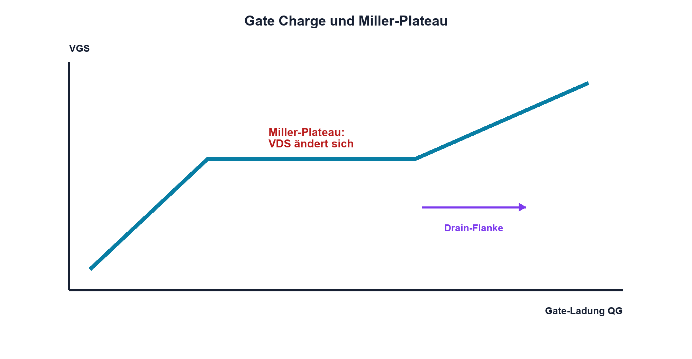

# Praxis 11 – MOSFET-Leistungsstufe aufbauen und Gate/Drain messen

[← Modul 11](../11-mosfets/README.md) · [Praxisübersicht](README.md) · [Kursübersicht](../README.md)

## Lernziel

Du wählst einen für die reale Gate-Spannung spezifizierten N-Kanal-MOSFET, baust eine strombegrenzte Low-Side-Stufe auf und misst VGS, VDS, Strom, Schaltzeit und Temperatur bei PWM.

## Benötigtes Material

Logic-Level-N-MOSFET mit Datenblatt, sichere ohmsche Last oder kleine Lampe, Gatewiderstände 10…220 Ω, 47-kΩ-Gate-Pulldown, geeigneter Shunt, lokale Abblockkondensatoren und kurze Verbindungen.

## Benötigte Messgeräte

Strombegrenztes Labornetzgerät, Funktionsgenerator oder MCU-PWM, Zweikanal-Oszilloskop, 10:1-Tastköpfe, DMM und berührungslose Temperaturmessung. Für schwebende Messpunkte nur geeignete Differentialtechnik.

## Schaltung / Messaufbau

Last von +U an Drain von Q1, Source über niederinduktiven Shunt an GND. Gate über Rg zum Treiber, Pulldown Gate-Source. Abblockkondensator liegt nahe Laststromschleife.

## Sicherheitshinweise

Nur SELV-Kleinspannung und begrenzte Leistung. VGS, VDS, ID, SOA und Bauteiltemperatur erhalten feste Abbruchgrenzen. Die Oszilloskopmasse niemals an Drain oder einen schwebenden Halbbrückenknoten klemmen. ESD-Schutz beim Umgang mit Q1.

## Vorbereitung

Dokumentiere garantierten RDS(on) bei realer VGS, maximal VGS/VDS, QG, SOA, thermische Daten und Pinout. Sage Gate- und Drainverlauf sowie Einfluss eines grösseren Rg voraus.

## Berechnung

Berechne Pcond mit heissem Maximal-RDS(on), grobes Psw, Pgate, Shuntspannung und erwartete stationäre Temperaturerhöhung. Lege PWM-Frequenz und Tastgrad zunächst konservativ fest.

## Aufbau

Stromlos aufbauen. Gate-Schleife und Leistungsschleife kurz halten. Pulldown, Pinout, Shuntleistung und Abblockung prüfen. Netzgerätstromgrenze einstellen; zuerst statisch mit kleinem Laststrom testen.

## Durchführung und Messung

1. Miss VGS im Aus- und Ein-Zustand direkt Gate-Source sowie VDS.
2. Aktiviere niedrige PWM-Frequenz und kontrolliere Logik, Tastgrad und Strom.
3. Miss tr, tf, Miller-Plateau, VDS-Überschwingen und Shuntstrom.
4. Vergleiche zwei Rg-Werte bei identischen Bedingungen.
5. Erhöhe Last oder Frequenz nur innerhalb der Freigabe und beobachte thermisches Einschwingen.

## Messwerte

| Rg | fs | D | VGS high | VDS on | IDrms | tr + tf | Überschwingen | Temperatur |
|---:|---:|---:|---:|---:|---:|---:|---:|---:|
| | | | | | | | | |

## Auswertung

Vergleiche Pcond und Psw mit Temperaturtrend. Erkläre Rg-Einfluss auf Schaltzeit und Ringing. Prüfe, ob gemessenes VGS wirklich der Datenblattbedingung für RDS(on) entspricht.

## Fragen

Warum genügt VGS(th) nicht? Woher kommt das Miller-Plateau? Weshalb kann höhere PWM-Frequenz überproportional heizen? Welche Messschleife erzeugt scheinbares Ringing?

## Was solltest du beobachtet haben?

Das Gate benötigt kurze Lade-/Entladeströme. Während der Drainflanke bleibt VGS im Plateau. Grösserer Rg verlangsamt die Flanken und kann Ringing reduzieren, erhöht aber die Übergangsenergie.

## Bezug zur Theorie

Lektionen 11.1 sowie 11.3–11.7; Projekt B übernimmt Datenblatt- und Messnachweise.

## 🔗 Hardware ↔ Firmware

Timerfrequenz, Comparewert, Ausgangspolarität und Resetmodus werden den realen Gate-/Drainverläufen gegenübergestellt. Jede Frequenzänderung verlangt erneute Verlust- und Temperaturprüfung.

## Bezug Bildungsplan 2026

`a3`, `b1-LK01–06`, `b4-LK01–10`, `b5`, `c1–c2`; Details: [Kompetenzmatrix](../bildungsplan-2026/kompetenzmatrix.md).
