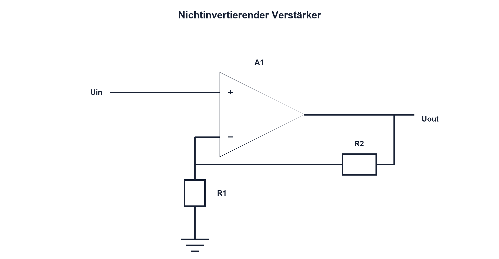

# Praxis 12 – Sensorsignal verstärken und vermessen

[← Modul 12](../12-operationsverstaerker/README.md) · [Praxisübersicht](README.md) · [Kursübersicht](../README.md)

## Lernziel

Du dimensionierst einen nichtinvertierenden Single-Supply-Verstärker für ein sicheres Sensorsignal, prüfst Common Mode, Ausgangshub, GBW und Slew Rate und vergleichst Soll- mit Messwerten bis zum ADC-Eingang.

## Benötigtes Material

Für 3,3 oder 5 V geeigneter, unity-gain-stabiler Rail-to-Rail-OPV mit Datenblatt, Präzisionswiderstände, Abblockkondensatoren, Potentiometer oder sichere Sensorsimulation, RC-Ausgangsfilter und Steckbrett.

## Benötigte Messgeräte

Strombegrenztes Labornetzgerät, Funktionsgenerator, Zweikanal-Oszilloskop mit 10:1-Tastköpfen und DMM.

## Schaltung / Messaufbau

Nichtinvertierende Stufe mit R1 vom invertierenden Eingang zu Vref/GND und R2 vom Ausgang zurück. Uin liegt am nichtinvertierenden Eingang. Versorgung wird direkt am OPV mit 100 nF und geeignetem Stützkondensator entkoppelt.

## Sicherheitshinweise

Nur Kleinspannung. Eingang und Ausgang dürfen Versorgungsschienen nicht überschreiten. Generatoroffset vor Anschluss prüfen. Ausgang nicht kurzschliessen und kapazitive Last nur gemäss Datenblatt verwenden.

## Vorbereitung

Definiere Sensorspannungsbereich und gewünschten ADC-Bereich mit Reserve. Prüfe OPV-Versorgung, Common-Mode-Eingang, Ausgangshub bei Last, Offset, Bias, GBW, Slew Rate und Stabilität. Sage DC-Werte und Sinusverstärkung voraus.

## Berechnung

Dimensioniere `Av = 1 + R2/R1`. Führe Worst Case aus Widerstandstoleranz und VOS durch. Schätze `fBW = GBW/Av` und `SRneeded = 2πfÛ`. Prüfe Ausgangsstrom und RC-Last.

## Aufbau

Spannungsfrei verdrahten. Versorgungspins und Abblockung zuerst prüfen. OPV-Typ und Pinout gegen Datenblatt kontrollieren. Netzgerätstromgrenze setzen; ohne Eingangssignal Ruhestrom und Ausgang kontrollieren.

## Durchführung und Messung

1. Lege mehrere DC-Sensorwerte an und miss Uplus, Uminus und Uout.
2. Bestimme reale Verstärkung und Offset aus einer linearen Ausgleichsgeraden.
3. Speise einen kleinen Sinus ein und miss Verstärkung sowie Phase bei mehreren Frequenzen.
4. Erhöhe Frequenz oder Amplitude kontrolliert bis vor Bandbreiten- beziehungsweise Slew-Begrenzung.
5. Ergänze die vorgesehene ADC-/Filterlast und prüfe Einschwingen sowie Überschwingen.

## Messwerte

| Uin | Uout Soll | Uout Ist | Fehler | Uplus − Uminus | Bedingung |
|---:|---:|---:|---:|---:|---|
| | | | | | |

| f | Uin pp | Uout pp | Av | Phase | Signalform |
|---:|---:|---:|---:|---:|---|
| | | | | | |

## Auswertung

Trenne konstanten Offset, Verstärkungsfehler und frequenzabhängige Abweichung. Prüfe, ob Clipping durch Ausgangshub, Common Mode, Stromgrenze oder Slew Rate entstand. Messbedingungen gehören zu jedem Punkt.

## Fragen

Wann gilt Uplus ≈ Uminus? Welche Abweichung kann kalibriert werden? Warum benötigt ein Rail-to-Rail-OPV trotzdem Reserve? Wie beeinflusst die ADC-Abtastkapazität den Ausgang?

## Was solltest du beobachtet haben?

Im linearen Bereich folgt Uout dem Widerstandsverhältnis. Nahe Schienen oder oberhalb der Dynamikgrenzen weicht die reale Stufe ab. Abblockung und Last beeinflussen die Stabilität sichtbar.

## Bezug zur Theorie

Lektionen 12.1–12.3 und 12.7; Vorbereitung für Projekt A und Modul 13.

## 🔗 Hardware ↔ Firmware

ADC-Rohwerte werden mit gleichzeitig gemessenem Uout verglichen. Firmwarekalibrierung darf erst nach Ausschluss von Sättigung, unzulässigem Common Mode und ungenügendem Einschwingen erfolgen.

## Bezug Bildungsplan 2026

`a3`, `b1-LK01–06`, `b4-LK01–10`, `b5`, `c1–c2`; Details: [Kompetenzmatrix](../bildungsplan-2026/kompetenzmatrix.md).
