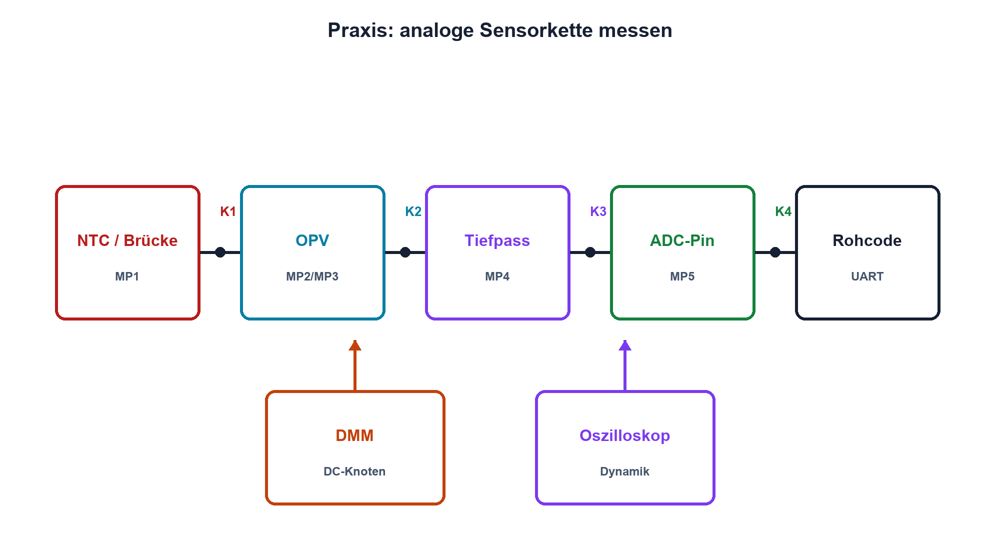

# Praxis 13 – Analoges Sensorsystem entwickeln

[← Modul 13](../13-analoge-signalaufbereitung/README.md) · [Praxisübersicht](README.md) · [Kursübersicht](../README.md)

## Lernziel

Du entwickelst eine sichere Sensormesskette aus resistivem Sensor, Teiler oder Brücke, OPV, aktivem beziehungsweise gepuffertem Filter und 0–3,3-V-ADC-Schnittstelle. Du sagst jeden Knotenbereich voraus und verifizierst Signal, Fehlerzustände und Einschwingen.

## Benötigtes Material

- NTC oder Widerstandssensor mit Datenblatt sowie Präzisionswiderstände
- für 3,3 oder 5 V geeigneter, unity-gain-stabiler OPV
- Widerstände für Verstärkung und Schutz, Kondensatoren für Filter und Abblockung
- optional Analogmultiplexer mit bekanntem RON
- Steckbrett oder vorbereitete Leiterplatte mit eindeutigem Massebezug

## Benötigte Messgeräte

Strombegrenztes Labornetzgerät, zwei DMM, Zweikanal-Oszilloskop mit 10:1-Tastköpfen, Funktionsgenerator für kleine sichere Testsignale und optional MCU/ADC-Board.

## Schaltung / Messaufbau

Sensor oder Sensorsimulator speist Teiler/Brücke. Der OPV verstärkt mit Reserve, das Filter begrenzt Bandbreite und ein Serienwiderstand schützt den ADC-Eingang. Messpunkte liegen an Sensor, Verstärkereingängen, OPV-Ausgang und ADC-Pin.

## Sicherheitshinweise

Nur SELV-Kleinspannung. Eingang und Ausgang müssen innerhalb der OPV- und ADC-Grenzen bleiben. Generatoroffset vor Anschluss prüfen. Fehlerzustände nur über strombegrenzte Widerstände einspeisen. Versorgung vor Umbauten ausschalten; OPV-Pinout und Abblockung vor dem ersten Einschalten kontrollieren.

## Vorbereitung

Definiere Messbereich, gewünschte ADC-Reserve, zulässigen Fehler, Bandbreite und Diagnosezustände. Erstelle eine Knotentabelle mit Minimum, Nennwert, Maximum und Bezugspotential. Sage Sensor- und Ausgangskennlinie voraus.

## Berechnung

Dimensioniere Teiler oder Brücke, Verstärkung und Offset. Berechne Grenzfrequenz, ADC-Quellimpedanz, Worst Case aus Widerständen und OPV-Offset sowie Schutzstrom bei den vereinbarten Fehlerpegeln. Lege Abbruchgrenzen fest.

## Aufbau

Baue in Funktionsblöcken auf. Prüfe zuerst Versorgung und Referenz ohne OPV, danach Ruhestrom und OPV-Ausgang ohne Sensor. Ergänze Sensor, Filter und ADC erst nach Freigabe des vorherigen Blocks.

## Durchführung

1. Stelle mindestens fünf Sensorwerte einschliesslich der Randwerte ein.
2. Miss an jedem Knoten DC-Soll und Ist; protokolliere Versorgung und Temperatur.
3. Speise ein kleines dynamisches Signal ein und bestimme Verstärkung, Phase und Grenzfrequenz.
4. Prüfe Sensorunterbruch und Kurzschluss über sichere Widerstände.
5. Falls ein MUX verwendet wird: Schalte zwischen zwei Pegeln und bestimme die nötige Wartezeit.
6. Vergleiche ADC-Rohwerte mit der gleichzeitig gemessenen Pinspannung.

## Messwerte

| Sensorzustand | Usensor | Uplus | Uminus | Uout | UADC | ADC-Rohcode | Bewertung |
|---|---:|---:|---:|---:|---:|---:|---|
| | | | | | | | |

| Frequenz | Verstärkung | Phase | Soll | Abweichung | Bedingung |
|---:|---:|---:|---:|---:|---|
| | | | | | |

## Auswertung

Trenne Nullpunkt-, Verstärkungs-, Nichtlinearitäts- und Dynamikfehler. Aktualisiere das Fehlerbudget mit Messwerten. Begründe, welche Abweichung kalibriert werden darf und welche eine Hardwareänderung verlangt.

## Fragen

Wo entsteht die grösste Unsicherheit? Welche Reserve verhindert Sättigung? Wie erkennst du Sensorunterbruch unabhängig von Firmware? Welcher Knoten begrenzt die Einschwingzeit?

## Was solltest du beobachtet haben?

Die Knotenspannungen folgen der vorhergesagten Kette, solange Common Mode und Ausgangshub eingehalten werden. Filter und MUX benötigen messbare Einschwingzeit. Fehlerzustände erzeugen definierte Diagnosebereiche statt unkontrollierter Übersteuerung.

## Bezug zur Theorie

Lektionen 13.1–13.7 sowie OPV-Grundlagen aus Modul 12 und Filtergrundlagen aus Modul 08.

## 🔗 Hardware ↔ Firmware

Firmware wählt Kanal und Wartezeit, liest Rohcodes und wendet Kalibrierung an. Der Laborbericht stellt jedem Rohcode die reale ADC-Pinspannung gegenüber. Diagnosegrenzen werden aus sicheren Hardwarebereichen abgeleitet.

## Bezug Bildungsplan 2026

`a1–a3`, `b1-LK01–10`, `b4-LK01–10`, `b5`, `c1–c2`, `d1–d3`; Details: [Kompetenzmatrix](../bildungsplan-2026/kompetenzmatrix.md).
