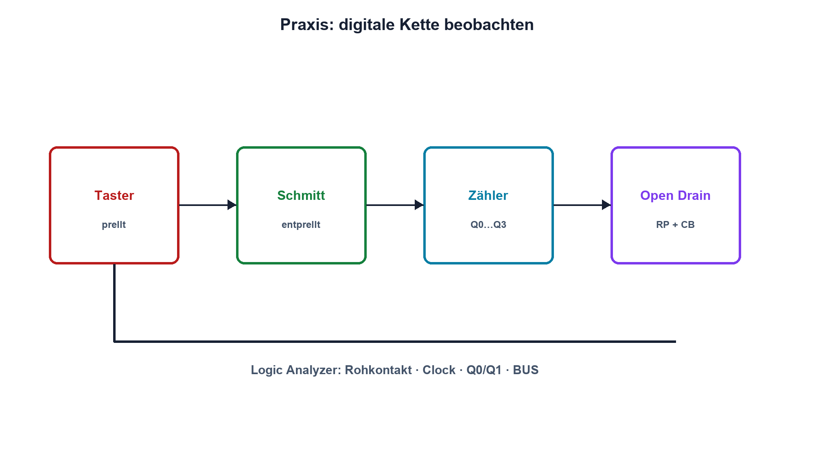

# Praxis 14 – Digitale Schaltung mit Logic Analyzer untersuchen

[← Modul 14](../14-digitaltechnik/README.md) · [Praxisübersicht](README.md) · [Kursübersicht](../README.md)

## Lernziel

Du baust eine kleine digitale Kette aus entprelltem Eingang, Flip-Flop/Zähler oder Schieberegister und Open-Drain-Ausgang auf. Du prüfst Wahrheitstabelle, Pegel, Taktbezug und reale Flanken mit Logic Analyzer und Oszilloskop.

## Benötigtes Material

3,3- oder 5-V-Logikfamilie mit Datenblatt, Taster, Pull-Widerstände, RC- und Schmitt-Entprellung, Zähler oder Schieberegister, LEDs mit Vorwiderständen, Open-Drain-Ausgang beziehungsweise geeigneter Transistor und Abblockkondensatoren.

## Benötigte Messgeräte

Strombegrenztes Labornetzgerät, DMM, mindestens vierkanaliger Logic Analyzer und Zweikanal-Oszilloskop mit 10:1-Tastköpfen.

## Schaltung / Messaufbau

Taster und Entprellung erzeugen Clock/Enable. Die sequenzielle Logik liefert mehrere Zustände; ein Ausgang wird zusätzlich als Open Drain mit externem Pull-up untersucht.

## Sicherheitshinweise

Nur SELV-Kleinspannung. Alle ICs erhalten lokale Abblockung und gemeinsame Masse. Unbenutzte CMOS-Eingänge werden definiert. Logic-Analyzer-Eingänge müssen zur Versorgung kompatibel sein. Ausgänge verschiedener Bausteine nie direkt gegeneinander schalten.

## Vorbereitung

Erstelle Wahrheitstabelle und erwartetes Zeitdiagramm. Prüfe VIH, VIL, VOH, VOL, Ausgangsstrom, Taktflanke und Resetpolarität. Lege eine gemeinsame Kanal- und Farbbezeichnung für alle Messgeräte fest.

## Berechnung

Dimensioniere LED- und Pull-Widerstände. Schätze Open-Drain-Low-Strom und RC-Anstiegszeit. Berechne Zählerüberlauf oder Übertragungsdauer des Schieberegisters.

## Aufbau

Spannungsfrei verdrahten. Versorgung, Pinout, Reset und Abblockung prüfen. Beginne mit langsamem manuellem Takt und geringer LED-Last; ergänze Logic Analyzer erst nach DMM-Prüfung.

## Durchführung

1. Zeichne Rohkontakt und entprelltes Signal gleichzeitig auf.
2. Prüfe alle statischen Eingangskombinationen gegen die Wahrheitstabelle.
3. Erfasse Clock, Data/Enable und mindestens zwei Ausgänge über mehrere Zustände.
4. Bestimme Verzögerung zwischen Taktflanke und Ausgang.
5. Vergleiche die Open-Drain-Flanke mit zwei Pull-up-Werten und zusätzlicher Kapazität.
6. Beobachte Reset und Einschaltzustand.

## Messwerte

| Zustand | Eingänge | Sollausgang | Istausgang | VOH/VOL | Bemerkung |
|---:|---|---|---|---:|---|
| | | | | | |

| RP | CB | Low-Strom | tr 30–70 % | Soll | Ist |
|---:|---:|---:|---:|---:|---:|
| | | | | | |

## Auswertung

Vergleiche logische Dekodierung mit analogen Pegeln. Erkläre Prellen, Laufzeit und Anstiegszeit. Beurteile, ob Logic-Analyzer-Schwellen oder Tastkopfbelastung das Ergebnis beeinflusst haben.

## Fragen

Warum kann der Logic Analyzer einen Zustand korrekt anzeigen, obwohl die Störreserve klein ist? Welche Flanke übernimmt das Flip-Flop? Was verändert RP ausser dem Strom? Ist der Resetzustand für die Last sicher?

## Was solltest du beobachtet haben?

Entprellung erzeugt aus mehreren Kontaktflanken einen stabilen Übergang. Sequenzielle Ausgänge ändern sich mit messbarer Verzögerung zur Taktflanke. Die Open-Drain-High-Flanke wird mit grösserem RP oder CB langsamer.

## Bezug zur Theorie

Lektionen 14.1–14.7; elektrische Grundgrössen aus Modul 02 und RC-Verhalten aus Modul 05.

## 🔗 Hardware ↔ Firmware

Vergleiche optional einen hardwareseitigen Zähler mit einem Timer-/GPIO-Signal des MCU. Registerzustand, Logic-Analyzer-Dekodierung und gemessener Pinpegel werden in einer Tabelle zusammengeführt.

## Bezug Bildungsplan 2026

`a3`, `b1-LK03–06`, `b4-LK01–10`, `b5`, `c1–c2` und hardwarebezogene Grundlagen zu `c5`; Details: [Kompetenzmatrix](../bildungsplan-2026/kompetenzmatrix.md).
