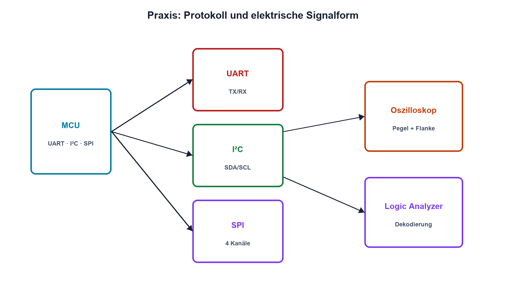

# Praxis 15 – UART, I²C und SPI elektrisch untersuchen

[← Modul 15](../15-schnittstellen-busse/README.md) · [Praxisübersicht](README.md) · [Kursübersicht](../README.md)

## Lernziel

Du unterscheidest Protokolldekodierung und elektrische Signalqualität. Du misst UART-, I²C- und SPI-Signale, vergleichst sie mit Konfiguration und Datenblatt und grenzt Hardware- von Firmwarefehlern ab.

## Benötigtes Material

MCU-Board mit 3,3-V-Logik, sichere UART-Gegenstelle, I²C-Sensor oder EEPROM, SPI-Baustein, austauschbare I²C-Pull-ups, kleine Serienwiderstände für SPI, kurze Leitungen und Datenblätter aller Teilnehmer.

## Benötigte Messgeräte

Vierkanaliges Oszilloskop oder Kombination aus Oszilloskop und Logic Analyzer, 10:1-Tastköpfe mit kurzen Massefedern sowie DMM. Keine direkte Messung an netzbezogenen oder unbekannten RS-232-/Industrieleitungen.

## Schaltung / Messaufbau

Die drei Schnittstellen verwenden gemeinsame Logikversorgung und definierten Bezug. Messpunkte liegen direkt an den MCU-Pins und – falls vorhanden – auf der Leitungsseite eines Transceivers.

## Sicherheitshinweise

Nur SELV-Kleinspannung. Vor Anschluss Pegelstandard und Massebezug prüfen. Oszilloskopmasse nur an den gemeinsamen Bezug anschliessen. Transceiver-Leitungsseiten nur innerhalb der Tastkopfgrenzen messen. Busparameter nicht während eines Schreibvorgangs an nichtflüchtige Speicher ändern.

## Vorbereitung

Dokumentiere Pinbelegung, Pegel, Baud-/Taktfrequenz, Wortformat, I²C-Adresse, SPI-Modus und erwartete Bitfolge. Sage für jeden Bus Idle-Zustand, aktive Flanke und maximalen Strom voraus.

## Berechnung

Berechne UART-Bitzeit, I²C-RP-Bereich aus Sinkstrom und Anstiegszeit sowie SPI-Transferzeit. Schätze zusätzliche Tastkopfkapazität und ihre Wirkung auf I²C.

## Aufbau

Verkabele stromlos und kurz. Prüfe Versorgung und Widerstände. Starte jede Schnittstelle einzeln mit konservativer Frequenz; aktiviere weitere Teilnehmer erst nach korrektem Grundsignal.

## Durchführung

1. UART: Messe TX, dekodiere ein bekanntes Byte und bestimme Bitzeit sowie 8N1-Rahmen.
2. I²C: Messe SDA/SCL, Start, Adresse, ACK und Stop. Bestimme tr zwischen 30 % und 70 %.
3. Tausche den I²C-Pull-up und vergleiche tr sowie Low-Strom.
4. SPI: Zeichne CS, SCLK, MOSI und MISO auf. Bestimme CPOL, CPHA, Bitreihenfolge und CS-Zeiten.
5. Vergleiche Logic-Analyzer-Dekodierung mit analogen Pegeln und Flanken.
6. Erzeuge je einen kontrollierten Fehler: falsche UART-Baudrate, fehlendes I²C-ACK oder falscher SPI-Modus. Dokumentiere das eindeutige Messmerkmal.

## Messwerte

| Bus | Parameter Soll | Parameter Ist | Pegel | Flanke/Zeit | Dekodierung | Bewertung |
|---|---:|---:|---:|---:|---|---|
| UART | | | | | | |
| I²C | | | | | | |
| SPI | | | | | | |

## Auswertung

Ordne jede Abweichung einer Ebene zu: Firmwarekonfiguration, MCU-Pin, externe Beschaltung, Transceiver/Teilnehmer oder Leitung. Beschreibe, welche zusätzliche Messung konkurrierende Hypothesen trennt.

## Fragen

Warum kann ein Decoder gültige Bytes bei schlechter Störreserve anzeigen? Welcher I²C-Pull-up ist elektrisch besser und warum nicht beliebig klein? Woran erkennst du falsches CPHA? Welche Messung trennt fehlendes ACK von langsamer High-Flanke?

## Was solltest du beobachtet haben?

UART zeigt konstante Bitzeit, I²C passive RC-High-Flanken und SPI aktiv getriebene schnelle Flanken. Protokolldaten und elektrische Signalform beantworten unterschiedliche Diagnosefragen.

## Bezug zur Theorie

Lektionen 15.1–15.7 sowie Open Drain aus 14.7 und Messtechnik-Grundlagen der früheren Module.

## 🔗 Hardware ↔ Firmware

Für jede Messung werden Firmwareparameter, Peripheralzustand, Pinmodus, reale Flanke und dekodierter Inhalt gemeinsam dokumentiert. Programmierdetails werden mit dem STM32-Kurs verknüpft, nicht dupliziert.

## Bezug Bildungsplan 2026

`a3`, `b1`, `b2-LK03–04`, `b4`, `b5`, `c1–c2`, hardwarebezogene Anteile von `d9`; Details: [Kompetenzmatrix](../bildungsplan-2026/kompetenzmatrix.md).
