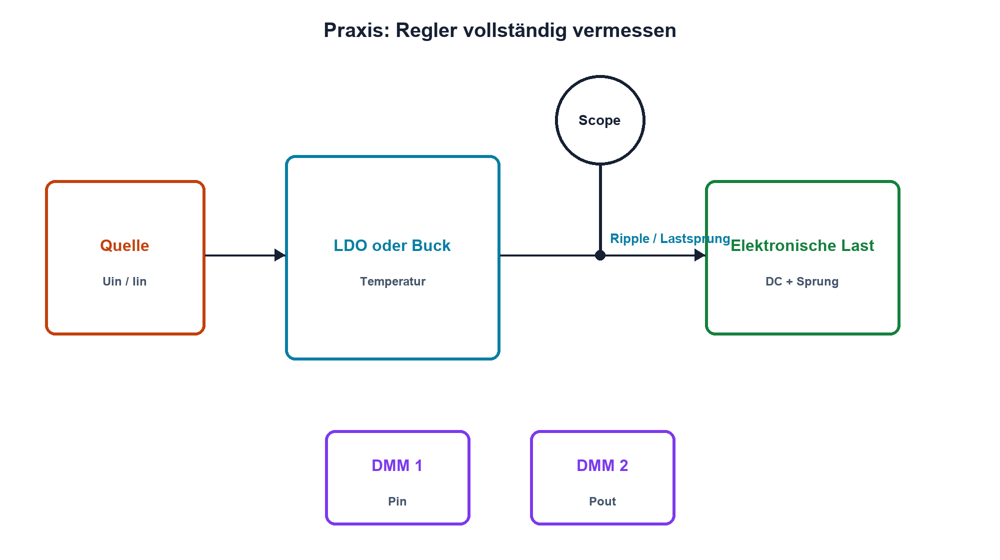

# Praxis 16 – Linear- und Schaltregler vermessen

[← Modul 16](../16-stromversorgungen/README.md) · [Praxisübersicht](README.md) · [Kursübersicht](../README.md)

## Lernziel

Du vergleichst einen LDO und ein sicheres Buck-Evaluationsmodul hinsichtlich Dropout, Lastregelung, Ripple, Wirkungsgrad, Lastsprung und Temperatur. Messpunkte und Unsicherheit werden so dokumentiert, dass die Resultate reproduzierbar sind.

## Benötigtes Material

LDO-Schaltung mit datenblattkonformen Kondensatoren, fertiges Kleinspannungs-Buck-Evaluationsmodul, Leistungswiderstände oder elektronische Last, geschaltete Last für Transienten, kurze Leitungen und Temperaturmessfläche.

## Benötigte Messgeräte

Zwei strombegrenzte Labornetzgeräte beziehungsweise Quelle und elektronische Last, mindestens zwei DMM, Zweikanal-Oszilloskop mit 10:1-Tastköpfen und Massefedern sowie Temperaturmessgerät. Optional Stromzange mit ausreichender Bandbreite.

## Schaltung / Messaufbau

Ein- und Ausgangsspannung werden direkt an den Regleranschlüssen gemessen; Ströme mit geeigneten Geräten in den jeweiligen Leistungspfaden. Ripple wird direkt am Ausgangskondensator, Lastsprung zusätzlich direkt am Verbraucher erfasst.

## Sicherheitshinweise

Nur SELV-Kleinspannung und freigegebene Evaluationshardware. Keine netzspannungsführenden Regler aufbauen oder messen. Strom- und Temperaturgrenzen vorab festlegen. Oszilloskopmasse niemals an Schaltknoten legen. Heisse Bauteile nicht berühren; Kondensatoren vor Umbauten entladen.

## Vorbereitung

Erstelle Lastpunkte bei etwa 10 %, 50 % und 90 % des freigegebenen Bereichs. Sage LDO-Verlustleistung, Buck-Eingangsstrom, Wirkungsgradtrend, Ripple und maximale Temperatur voraus. Definiere Messbandbreite und Abbruchkriterien.

## Berechnung

Berechne Pin, Pout, PV und η für alle Sollpunkte. Schätze LDO-TJ mit Datenblattthermik. Bestimme ideal notwendige Kapazität für den geplanten Lastsprung und erwarteten ESR-Sprung.

## Aufbau

Kontrolliere Polarität, Kondensatoren, Lastleistung und Messbereiche. Stelle Stromgrenze mit abgetrennter Schaltung ein. Nimm zuerst ohne Last, dann schrittweise in Betrieb.

## Durchführung

1. LDO: Variiere Uin und bestimme Dropout bei konstanter Last.
2. Vermesse Uout, Pin, Pout, PV und Temperatur bei drei Lastpunkten.
3. Buck: Wiederhole die Leistungs- und Temperaturmessung nach thermischem Einschwingen.
4. Miss Ripple mit Massefeder und definierter Bandbreite; führe einmal bewusst die lange Masseleitung zum Vergleich vor.
5. Schalte zwischen zwei Lasten und erfasse Strom, Einbruch, Überschwingen und Einschwingzeit.
6. Vergleiche Messwerte mit Datenblatt, Rechnung und Lastprofil.

## Messwerte

| Regler | Uin | Iin | Uout | Iout | Pin | Pout | η | Temperatur |
|---|---:|---:|---:|---:|---:|---:|---:|---:|
| | | | | | | | | |

| Regler | Lastsprung | Ripple Upp | Einbruch | Überschwingen | Einschwingzeit | Messbandbreite |
|---|---:|---:|---:|---:|---:|---|
| | | | | | | |

## Auswertung

Erstelle Wirkungsgrad- und Temperaturdiagramm über Last. Trenne echten Ripple von Messschleifenartefakten. Erkläre Abweichungen durch Kabel, Ruhestrom, Bauteiltoleranz, thermischen Zustand und dynamische Regelung.

## Fragen

Warum ist der LDO bei grosser Spannungsdifferenz thermisch kritisch? Warum fällt der Buck-Wirkungsgrad bei kleiner Last? Welche Kurve belegt Dropout? Was zeigt die Messung am Verbraucher zusätzlich zur Reglerklemme?

## Was solltest du beobachtet haben?

Der LDO besitzt geringe Schaltstörung, aber Verlust proportional zur Spannungsdifferenz. Der Buck erreicht meist höheren Wirkungsgrad, zeigt jedoch Schalt- und Regelripple. Kurze Messverbindungen verändern das beobachtete Hochfrequenzsignal deutlich.

## Bezug zur Theorie

Lektionen 16.1–16.7 sowie Kondensatoren aus Modul 05, Spulen aus Modul 06 und MOSFET-Verluste aus Modul 11.

## 🔗 Hardware ↔ Firmware

Optional erzeugt Firmware reproduzierbare Lastmuster und markiert sie mit einem Trigger-GPIO. Brownout- oder Power-Good-Status wird zeitlich zur gemessenen Versorgung betrachtet.

## Bezug Bildungsplan 2026

`a1–a3`, `b1`, `b2-LK03–04`, `b4-LK01–10`, `b5`, `c1–c2`; Details: [Kompetenzmatrix](../bildungsplan-2026/kompetenzmatrix.md).
